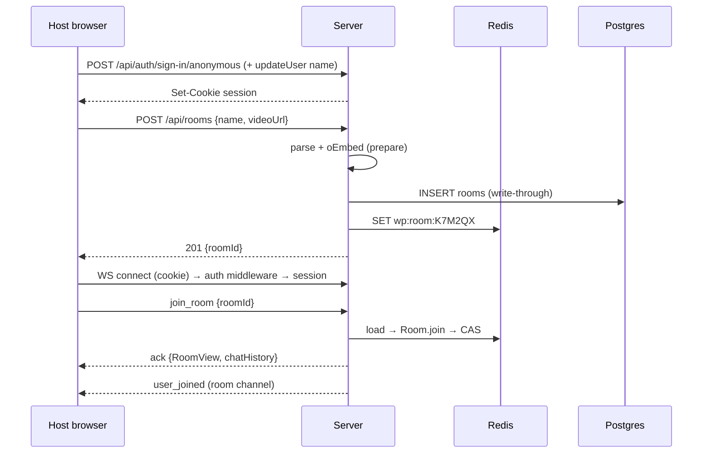
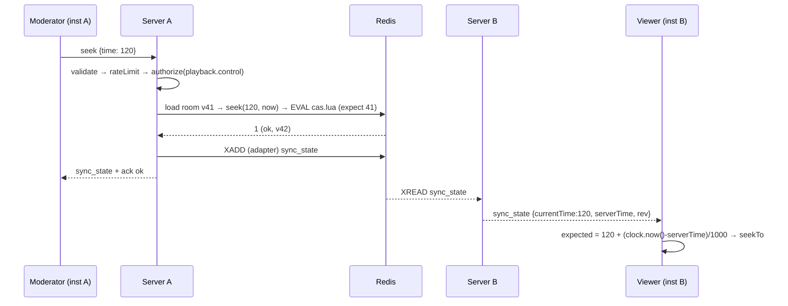
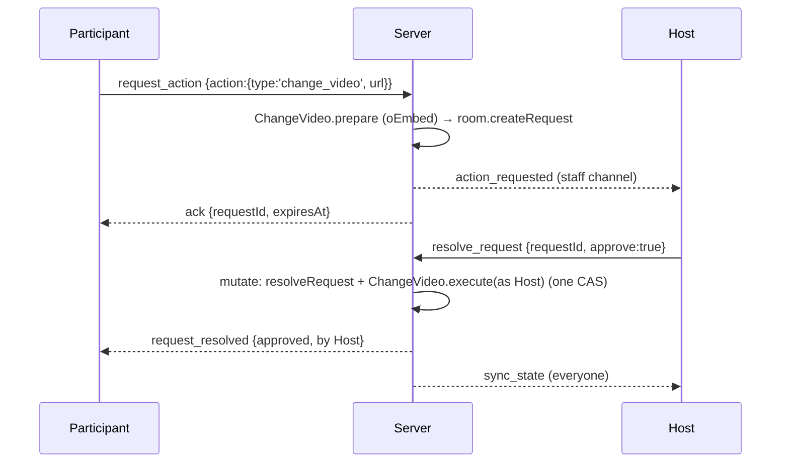
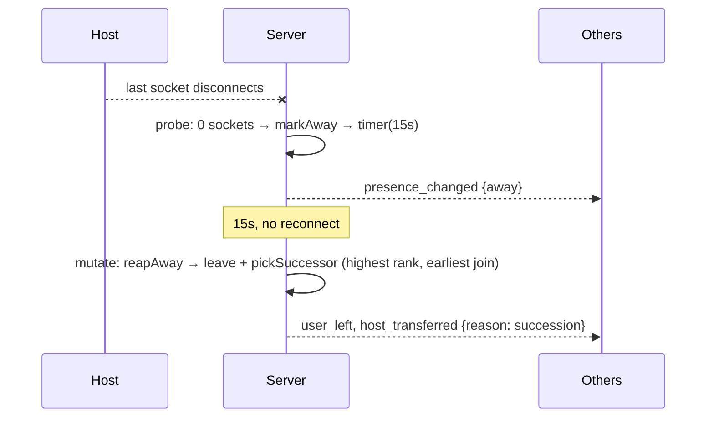

# YouTube Watch Party: Low-Level Design

> Companion to [`plan.md`](./plan.md). That file says **what** we ship and **when**. This one fixes **how**, down to class names, interfaces, payloads, constants, and failure behavior. Nothing here is "TBD": if something isn't in this document, it's out of scope (see §25 Non-Goals).
>
> Every sub-problem is written as **Why → What → How**.
> - *Why*: the problem and the constraint that makes it hard.
> - *What*: the components, contracts, and data involved.
> - *How*: the algorithm, the library used, and the SOLID/DRY reasoning.

---

## Table of Contents
1. [Design Principles (how SOLID & DRY are applied, concretely)](#1-design-principles)
2. [Build-vs-Buy: Library Decisions](#2-build-vs-buy-library-decisions)
3. [Repository & Module Layout](#3-repository--module-layout)
4. [Sub-problem Map](#4-sub-problem-map)
5. [SP-1 Shared Contract (events, schemas, errors)](#sp-1-shared-contract)
6. [SP-2 Identity & Authentication](#sp-2-identity--authentication)
7. [SP-3 Roles & Permission Policy](#sp-3-roles--permission-policy)
8. [SP-4 Room Aggregate (domain model)](#sp-4-room-aggregate)
9. [SP-5 Playback State & Time Model](#sp-5-playback-state--time-model)
10. [SP-6 Persistence: Repositories, CAS, Write-Behind](#sp-6-persistence)
11. [SP-7 Command Pipeline (server realtime core)](#sp-7-command-pipeline)
12. [SP-8 Broadcasting: Domain Events → Wire Events](#sp-8-broadcasting)
13. [SP-9 Presence, Lifecycle & Host Succession](#sp-9-presence-lifecycle--host-succession)
14. [SP-10 Participant Approval Workflow](#sp-10-participant-approval-workflow)
15. [SP-11 Video URL Parsing & Metadata](#sp-11-video-url-parsing--metadata)
16. [SP-12 Clock Synchronization](#sp-12-clock-synchronization)
17. [SP-13 Client Player Sync Engine](#sp-13-client-player-sync-engine)
18. [SP-14 Client State & Socket Binding](#sp-14-client-state--socket-binding)
19. [SP-15 Chat & Reactions](#sp-15-chat--reactions)
20. [SP-16 Video Queue](#sp-16-video-queue)
21. [SP-17 Rate Limiting & Security](#sp-17-rate-limiting--security)
22. [SP-18 HTTP API](#sp-18-http-api)
23. [SP-19 Horizontal Scaling](#sp-19-horizontal-scaling)
24. [SP-20 Config, Observability, Composition Root](#sp-20-config-observability-composition-root)
25. [SP-21 Frontend Component Architecture](#sp-21-frontend-component-architecture)
26. [SP-22 Testing Strategy](#sp-22-testing-strategy)
27. [SP-23 Deployment](#sp-23-deployment)
28. [Sequence Diagrams](#sequence-diagrams)
29. [Constants](#constants)
30. [Error Catalogue](#error-catalogue)
31. [Non-Goals](#non-goals)
32. [Requirement Traceability](#requirement-traceability)

---

## 1. Design Principles

### 1.1 SOLID, mapped to concrete decisions

| Principle | Where it shows up | Concretely |
|---|---|---|
| **S**ingle Responsibility | `Room` is split into `MemberRegistry`, `PlaybackState`, `VideoQueue`, `RequestBook`. The pipeline is split into `validate`, `rateLimit`, `resolveMembership`, `authorize`, `execute`, `broadcast` | Each class has exactly one reason to change. `Room` coordinates them and enforces invariants that span several of them |
| **O**pen/Closed | `CommandHandler` registry. `ROLE_CAPABILITIES` is a data table. `DomainEvent → WireEvent` presenters | Adding an event means adding one handler class and one schema. The dispatcher, the pipeline, and other handlers stay untouched |
| **L**iskov Substitution | `RoomRepository` has `InMemory`, `Redis`, and `Tiered` implementations. `VideoPlayer` has `YouTubePlayerAdapter` and `FakePlayer`. `ServerClock` has `TimesyncClock` and `FakeClock` | One shared **contract test suite** runs against every implementation of an interface, which proves they are substitutable |
| **I**nterface Segregation | Small ports: `Clock`, `IdGenerator`, `SessionResolver`, `VideoMetadataProvider`, `RateLimiter`, `PresenceProbe`, `ChatRepository` | No "god service" interfaces. Each handler gets a `CommandContext` exposing only the ports it needs |
| **D**ependency Inversion | Domain and application layers depend on interfaces in `ports/`. Infrastructure implements them and is wired together in a single composition root (`main.ts`) | `Room` imports no I/O. Tests swap implementations without mocking frameworks |

### 1.2 DRY, single sources of truth

| Knowledge | Single source | Consumers |
|---|---|---|
| Event names + payload shapes | `packages/shared/src/contract/*.ts` (zod) | Server validation, server typing, client typing, approval-workflow payloads |
| Who can do what | `packages/shared/src/permissions.ts` | Server `authorize` middleware **and** client `useCan()` (UI disabling) |
| Playback position math | `PlaybackState.positionAt()` / shared `projectPosition()` | Server state transitions, client sync engine, client UI clock |
| Error codes + messages | `packages/shared/src/errors.ts` | Server `DomainError`, ack responses, client toast text |
| Constants (TTLs, limits, thresholds) | `packages/shared/src/constants.ts` | Server and client |
| YouTube ID extraction | `packages/shared/src/youtube.ts` (wraps `get-video-id`) | Server validation, client input preview |
| "Execute an action" logic | The `CommandHandler`s | Direct execution **and** execution after approval of a participant's request (no second code path) |

### 1.3 Patterns used (and only where they earn their place)

| Pattern | Where | Why it is needed here |
|---|---|---|
| **Aggregate Root** (DDD) | `Room` | One consistency boundary, versioned as a unit, which makes compare-and-set (CAS) possible |
| **Value Object** | `PlaybackState`, `VideoRef`, `RoomCode` | Immutable values with no aliasing bugs. Equality by value |
| **Command + Registry** | `CommandHandler<E>` + `CommandRegistry` | Open/Closed event handling. Also lets approval *replay* a command |
| **Chain of Responsibility / middleware** | `CommandPipeline` | Cross-cutting steps (validation, rate limiting, authorization) written once |
| **Domain Events + Observer** | `Room.pullEvents()` → `Broadcaster` | Keeps the domain pure and centralizes every emit in one place |
| **Repository** | `RoomRepository`, `ChatRepository`, `MembershipRepository` | Persistence behind interfaces |
| **Decorator** | `TieredRoomRepository(hot, cold)` | Read-through and write-behind added without touching `RedisRoomRepository` |
| **Strategy** | Repository / rate-limiter / Socket.IO adapter chosen by config (Redis or memory) | Single-instance dev and multi-instance prod run the same code |
| **Adapter (Ports & Adapters)** | `YouTubePlayerAdapter`, `BetterAuthSessionResolver`, `OEmbedMetadataProvider` | Third-party APIs never leak into domain or React components |
| **Unit of Work** | `RoomService.mutate(id, fn)` | Load → mutate → CAS save → emit, with retry, in one place |
| **Factory** | `Room.create()`, `createSocket()`, `buildContainer()` | Correct construction stays centralized |
| **Presenter** | `RoomPresenter` | Domain snapshot → public view (hides bans and internal fields) |

**Explicitly not used (YAGNI):** DI containers (inversify/tsyringe), CQRS/event sourcing, message queues, GraphQL. Manual constructor injection in one composition root is easier to explain in the walkthrough and fits this size of app.

### 1.4 Layering rule (enforced by folder structure + ESLint `import-x/no-restricted-paths`)

```
shared (pure TS + zod)  ◀── domain (pure)  ◀── application (services, pipeline, ports)  ◀── infrastructure (redis, pg, auth, http, socket)  ◀── main.ts
```
Arrows point to what a layer may import. `domain` never imports `application` or `infrastructure`.

---

## 2. Build-vs-Buy: Library Decisions

All versions were checked against the npm registry on 2026-10-01. **Rule: use a maintained library whenever one solves the sub-problem. Write our own code only where we add domain value.**

### 2.1 Chosen

| Sub-problem | Library | Version | Why this one |
|---|---|---|---|
| Realtime transport | `socket.io` / `socket.io-client` | 4.8.4 | Rooms, acks (`emitWithAck`), auto-reconnect, **typed event generics**, connection state recovery, cross-instance `fetchSockets()` / `socketsJoin()` / `disconnectSockets()`. Suggested by the brief |
| Cross-instance fan-out | `@socket.io/redis-streams-adapter` + `redis` (node-redis) | 0.3.1 / 6.3.0 | Unlike the classic `@socket.io/redis-adapter`, it is **compatible with connection state recovery** and survives brief Redis disconnects without losing packets (Socket.IO docs) |
| Redis client | `redis` (node-redis) | 6.3.0 | The adapter's documented client. Reusing it for state, Lua CAS, and rate limiting means **one client library** (DRY). `ioredis` was rejected to avoid running two clients |
| Validation + types | `zod` | 4.6.5 | One schema produces both the runtime validator and the static type. Shared by client and server |
| Auth (guest + login) | `better-auth` (+ `anonymous` plugin, `drizzle` adapter) | 1.7.7 | Guest sessions (`signIn.anonymous`) and email/password in one library, with **anonymous → real account linking** (`onLinkAccount`). Cookie sessions work with same-origin WebSockets. `getSession({headers: fromNodeHeaders(...)})` works directly on the Socket.IO handshake |
| ORM + migrations | `drizzle-orm` + `drizzle-kit` + `pg` | 0.45.3 / 8.23.1 | SQL-first, no engine binary, first-class better-auth adapter. Prisma's `latest` tag is currently an 8.0 **RC**, which we don't want to depend on in a 24h build |
| YouTube player | `youtube-player` (gajus) | 5.6.0 | Promise-based wrapper over the IFrame API that queues calls until the player is ready. `react-youtube` is a thin React wrapper around this same lib. We need imperative control, so we use the core directly |
| YouTube ID parsing | `get-video-id` | 4.2.0 | Handles watch, `youtu.be`, `/shorts/`, `/live/`, `/embed/`, and `?si=`/`t=` params. Maintained (2026) |
| Clock sync | `timesync` | 1.0.11 | Implements the NTP-style multi-sample offset algorithm with a pluggable transport (`send`/`receive`). We plug in Socket.IO acks. Small and dependency-free. The algorithm is mature, so the age is acceptable |
| Rate limiting | `rate-limiter-flexible` | 11.2.1 | Token-bucket with `RateLimiterMemory` and `RateLimiterRedis` (node-redis supported), one API for both (Strategy) |
| Per-room in-process lock | `async-mutex` | 0.5.0 | Serializes mutations of the same room on one instance, so CAS conflicts only happen between instances |
| IDs / room codes | `nanoid` (`customAlphabet`) | 6.0.1 | Collision-resistant, URL-safe codes without ambiguous characters |
| Metadata cache | `lru-cache` | 11.5.3 | TTL'd LRU cache for oEmbed lookups |
| Logging | `pino` + `pino-http` | 10.3.1 / 11.0.0 | Structured JSON logs and cheap child loggers per socket |
| Metrics | `prom-client` | 15.1.3 | Standard Prometheus `/metrics` |
| HTTP | `express` + `helmet` | 5.2.1 / 8.3.0 | Brief-suggested. Helmet handles CSP (YouTube frames allowed) |
| Frontend | `react` 19 + `vite` + `react-router` 8 + `@tanstack/react-query` 5 + `zustand` 5 | — | Vite is brief-recommended. React Query for REST. Zustand for socket-fed room state (selectors avoid re-render storms) |
| UI kit | `tailwindcss` 4 + `shadcn/ui` (Radix) + `lucide-react` + `sonner` | — | Accessible primitives (Dialog, DropdownMenu, Slider, Tabs, Tooltip). Sonner for toasts with action buttons (Approve/Reject) |
| Reaction animation | `motion` | 13.5.0 | `AnimatePresence` floating emojis in about 20 lines |
| Tests | `vitest` 5, `@playwright/test` 1.63 | — | Fast TS-native unit and integration tests. Two-context browser E2E |
| Language | `typescript` (pinned **6.0.3**) | 6.0.3 | TS 7 (native compiler) is `latest`, but `typescript-eslint` 8.71 requires `>=4.8.4 <6.1.0`. Type-aware lint is mandatory (rules §6), so we pin the newest supported 6.0.x |
| Lint | `eslint` 10 + `typescript-eslint` (strict-type-checked) + `eslint-plugin-import-x` + `eslint-import-resolver-typescript` + `eslint-config-prettier` + `eslint-plugin-react-hooks` + `eslint-plugin-react-refresh` | 10.11 / 8.71 / 4.17 / 4.4 / 10.1 / 7.1 / 0.5 | `import-x/no-restricted-paths` enforces the layering rule (§1.4). `eslint-plugin-import` was rejected because it doesn't support ESLint 10 |
| Format | `prettier` | 3.9.9 | |
| Server bundling | `tsdown` | 0.23.0 | Bundles `apps/server` together with the source-only `@watchparty/shared` package into one ESM file. It's the maintained successor to `tsup` (whose README recommends migrating) and is Rolldown-based like Vite 8 |
| Dev runner | `tsx` | 4.23.15 | Runs the server TS directly with watch mode |
| Shared package build | *(none)* | — | `@watchparty/shared` is consumed as **TypeScript source** ("internal package"). Vite and tsdown compile it in place, so there's no second build step or stale `dist` (DRY) |

### 2.2 Considered and rejected

| Option | Rejected because |
|---|---|
| `@socket.io/redis-adapter` (pub/sub) | Not compatible with connection state recovery (documented) |
| `ws` (raw) | We would have to rebuild rooms, acks, reconnection, and cross-node broadcast ourselves |
| Prisma | `latest` dist-tag is an RC. Heavier toolchain. Drizzle integrates more cleanly with better-auth |
| `react-youtube` | Declarative props fight imperative sync control. It's a wrapper over `youtube-player` anyway |
| `redlock` | Only a 5.0 beta (2022). Optimistic CAS through a Lua script is simpler and doesn't need lock leases |
| Artillery `socketio` engine | Can't easily do the better-auth cookie handshake per virtual user or measure per-room fan-out latency. A ~120-line `socket.io-client` script measures exactly what we claim |
| YouTube Data API v3 | Needs an API key and quota. Keyless **oEmbed** gives title, thumbnail, and an embeddability check |
| DOMPurify / sanitize-html | We never render user HTML. React escapes text by default. zod trims and limits length |
| Emoji picker libs | We use a fixed set of 8 reactions. A picker would be unused weight (YAGNI) |
| Upstash Redis | REST-first. Blocking stream reads and long-lived TCP connections from the streams adapter are a risk there. Render Key Value (Redis-compatible, same private network) is the safer choice |

### 2.3 Prior art studied (open source)

We looked at public watch-party repositories built with Socket.IO, e.g. [avsheshkush/watchparty](https://github.com/avsheshkush/watchparty), [raj070504/youtube-watchparty](https://github.com/raj070504/youtube-watchparty), [Aadarshti18/watch-party](https://github.com/Aadarshti18/watch-party), and [ahmedsadman/redparty](https://github.com/ahmedsadman/redparty).

**What we adopt:** server-authoritative state, a periodic drift check that seeks only past a threshold, and a Redis-backed scale-out story.

**Where we go further:**
1. Clock-offset-corrected positions instead of trusting arrival time.
2. No native YouTube controls, which **removes the echo-loop problem by construction** (SP-13).
3. Versioned CAS on the room aggregate for multi-instance correctness.
4. The approval workflow reuses the same command handlers.
5. Connection state recovery plus a presence grace period.
6. One permission table shared by UI and server.

---

## 3. Repository & Module Layout

```
watch-party/
├─ package.json                  # pnpm workspaces, root scripts (dev, build, test, lint, typecheck)
├─ pnpm-workspace.yaml
├─ tsconfig.base.json            # strict, noUncheckedIndexedAccess, exactOptionalPropertyTypes
├─ docker-compose.yml            # postgres, redis, server×2, nginx (scale demo)
├─ infra/nginx.conf              # websocket upgrade + least_conn
├─ tools/loadtest/               # socket.io-client load generator + report
├─ .github/workflows/ci.yml
├─ packages/
│  └─ shared/src/
│     ├─ contract/
│     │  ├─ primitives.ts        # RoomCode, UserId, DisplayName, VideoId, Seconds, Role...
│     │  ├─ client-events.ts     # zod schemas for every C→S event + ack data types
│     │  ├─ server-events.ts     # TS types for every S→C event
│     │  ├─ views.ts             # RoomView, ParticipantView, PlaybackView, RequestView, ChatMessageView
│     │  └─ index.ts             # ClientToServerEvents / ServerToClientEvents (Socket.IO generics)
│     ├─ permissions.ts          # Role, Capability, ROLE_CAPABILITIES, PermissionPolicy
│     ├─ playback.ts             # projectPosition() pure fn
│     ├─ youtube.ts              # parseYouTubeId() wrapping get-video-id
│     ├─ errors.ts               # ErrorCode enum, ERROR_MESSAGES, AckResult<T>
│     └─ constants.ts
├─ apps/
│  ├─ server/src/
│  │  ├─ domain/                 # PURE: no I/O, no Date.now(), no Math.random()
│  │  │  ├─ Room.ts              # aggregate root
│  │  │  ├─ MemberRegistry.ts
│  │  │  ├─ Participant.ts
│  │  │  ├─ PlaybackState.ts
│  │  │  ├─ VideoQueue.ts
│  │  │  ├─ RequestBook.ts
│  │  │  ├─ VideoRef.ts
│  │  │  ├─ events.ts            # DomainEvent union
│  │  │  ├─ snapshot.ts          # RoomSnapshot type + (de)serialization
│  │  │  └─ DomainError.ts
│  │  ├─ application/
│  │  │  ├─ ports.ts             # Clock, IdGenerator, RoomRepository, ChatRepository, MembershipRepository,
│  │  │  │                       # SessionResolver, VideoMetadataProvider, RateLimiter, PresenceProbe, Broadcaster
│  │  │  ├─ RoomService.ts       # unit of work: mutate / read / create
│  │  │  ├─ PresenceService.ts   # connect/disconnect/grace/reap
│  │  │  ├─ ChatService.ts
│  │  │  ├─ RoomPresenter.ts
│  │  │  └─ commands/
│  │  │     ├─ CommandHandler.ts # interface + CommandContext
│  │  │     ├─ CommandRegistry.ts
│  │  │     ├─ CommandPipeline.ts
│  │  │     ├─ middleware/       # validate.ts, rateLimit.ts, membership.ts, authorize.ts
│  │  │     └─ handlers/         # one file per event (JoinRoom, Play, Pause, Seek, ChangeVideo, ...)
│  │  ├─ infrastructure/
│  │  │  ├─ config.ts            # zod env parsing
│  │  │  ├─ logger.ts, metrics.ts
│  │  │  ├─ db/                  # drizzle client, schema.ts, migrations/
│  │  │  ├─ redis/               # client factory, lua/cas.lua
│  │  │  ├─ repositories/        # InMemoryRoomRepository, RedisRoomRepository, PostgresRoomRepository,
│  │  │  │                       # TieredRoomRepository, PgChatRepository, PgMembershipRepository
│  │  │  ├─ auth/                # better-auth instance, BetterAuthSessionResolver
│  │  │  ├─ video/               # OEmbedMetadataProvider
│  │  │  ├─ ratelimit/           # RateLimiterFlexibleAdapter
│  │  │  ├─ realtime/            # SocketGateway, SocketBroadcaster, SocketPresenceProbe, channels.ts
│  │  │  └─ http/                # app.ts, routes/rooms.ts, routes/health.ts, spa.ts
│  │  └─ main.ts                 # composition root + graceful shutdown
│  └─ web/src/
│     ├─ app/                    # router, providers, layout
│     ├─ lib/                    # socket.ts, rpc.ts, authClient.ts, queryClient.ts
│     ├─ features/
│     │  ├─ auth/                # GuestNameDialog, SignUpDialog, useSession
│     │  ├─ lobby/               # LandingPage, CreateRoomForm, JoinRoomForm, RecentRooms
│     │  ├─ room/                # RoomPage, store.ts, bindRoomEvents.ts, useRoomConnection.ts, useCan.ts
│     │  ├─ player/              # VideoPlayer.ts (port), YouTubePlayerAdapter.ts, SyncEngine.ts,
│     │  │                       # TimesyncClock.ts, usePlayerSync.ts, PlayerSurface.tsx, ControlBar.tsx
│     │  ├─ participants/        # ParticipantList, ParticipantRow, MemberActionsMenu
│     │  ├─ requests/            # RequestsPanel, RequestToast
│     │  ├─ chat/                # ChatPanel, MessageList, Composer
│     │  ├─ reactions/           # ReactionBar, ReactionOverlay, ReactionMarkers
│     │  └─ queue/               # QueuePanel, AddToQueueForm
│     └─ components/ui/          # shadcn generated
```

---

## 4. Sub-problem Map

```
                    ┌──────────────── SP-1 Shared Contract ────────────────┐
                    │ (schemas, permissions, errors, constants, math)      │
                    └───────▲───────────────────────────────▲──────────────┘
          SERVER            │                               │           CLIENT
 SP-2 Identity ──► SP-7 Command Pipeline ◄── SP-17 Limits   │  SP-14 State & Socket ──► SP-21 UI
                     │   │        │                         │        │
          SP-3 Policy┘   ▼        ▼                         │  SP-13 Sync Engine ◄── SP-12 Clock
              SP-4 Room aggregate ── SP-5 Playback          │        │
                 │  ├ SP-10 Requests  ├ SP-16 Queue         │  SP-11 URL parsing (shared)
                 ▼                                          │
         SP-6 Persistence ──► SP-19 Scaling                 │
         SP-8 Broadcasting ──► Socket.IO ═══ WebSocket ═════╝
         SP-9 Presence/Lifecycle      SP-15 Chat/Reactions     SP-18 HTTP     SP-20 Config/Obs
```

---

## SP-1 Shared Contract

**Why.** Client/server drift is the most common integration bug in realtime apps: a renamed field fails silently at runtime. The brief also *requires* the backend to validate events.

**What.** `packages/shared` defines every client→server event as a zod schema, every server→client event as a TS type, the views, the error codes, and the constants. Socket.IO's typed generics consume these types, so a payload typo is a compile error on both sides.

**How.**

```ts
// contract/primitives.ts
export const RoomCode    = z.string().trim().toUpperCase().regex(/^[ROOM_CODE_ALPHABET]{ROOM_CODE_LENGTH}$/); // built from constants
export const UserId      = z.string().min(1).max(64);
export const DisplayName = z.string().trim().min(1).max(32);
export const VideoUrl    = z.string().trim().min(1).max(500);   // parsed server-side to VideoId
export const Seconds     = z.number().min(0).max(MAX_MEDIA_SECONDS);   // zod 4 rejects Infinity/NaN by default
export const Role        = z.enum(['host', 'moderator', 'participant', 'viewer']);
export const AssignableRole = Role.exclude(['host']);            // host only via transfer_host
export const ReactionEmoji  = z.enum(REACTION_SET);              // from constants
```

```ts
// contract/client-events.ts: THE single list of client intents
export const ClientEventSchemas = {
  join_room:          z.object({ roomId: RoomCode, displayName: DisplayName.optional() }),
  leave_room:         z.object({ roomId: RoomCode }),
  play:               z.object({}),
  pause:              z.object({}),
  seek:               z.object({ time: Seconds }),
  change_video:       z.object({ url: VideoUrl }),
  assign_role:        z.object({ userId: UserId, role: AssignableRole }),
  remove_participant: z.object({ userId: UserId }),
  transfer_host:      z.object({ userId: UserId }),
  queue_add:          z.object({ url: VideoUrl }),
  queue_remove:       z.object({ itemId: EntityId }),
  request_action:     z.object({ action: RequestableAction }),    // see SP-10
  resolve_request:    z.object({ requestId: EntityId, approve: z.boolean() }),
  chat_message:       z.object({ text: z.string().trim().min(1).max(CHAT_MAX_LEN) }),
  reaction:           z.object({ emoji: ReactionEmoji, videoTime: Seconds }),
  report_duration:    z.object({ videoId: VideoId, duration: Seconds.min(1) }),
  video_ended:        z.object({ videoId: VideoId, rev: z.number().int().nonnegative() }),
  timesync:           z.looseObject({ id: z.union([z.number(), z.string()]), method: z.literal('timesync') }),
} as const;

export type ClientEventName = keyof typeof ClientEventSchemas;
export type ClientPayload<E extends ClientEventName> = z.infer<(typeof ClientEventSchemas)[E]>;
```

```ts
// errors.ts: one ack envelope for every command
export type AckResult<T> = { ok: true; data: T } | { ok: false; error: { code: ErrorCode; message: string } };

// contract/index.ts: derived, never hand-written twice
export type ClientToServerEvents = {
  [E in ClientEventName]: (payload: ClientPayload<E>, ack: (res: AckResult<AckData[E]>) => void) => void;
};
export interface ServerToClientEvents {
  sync_state(p: PlaybackView): void;
  user_joined(p: { userId: string; username: string; role: Role; participants: ParticipantView[] }): void;
  user_left(p: { userId: string; username: string; reason: 'left' | 'timeout'; participants: ParticipantView[] }): void;
  presence_changed(p: { userId: string; presence: 'online' | 'away'; participants: ParticipantView[] }): void;
  role_assigned(p: { userId: string; username: string; role: Role; participants: ParticipantView[] }): void;
  host_transferred(p: { fromUserId: string; toUserId: string; reason: 'manual' | 'succession'; participants: ParticipantView[] }): void;
  participant_removed(p: { userId: string; participants: ParticipantView[] }): void;
  kicked(p: { roomId: string; reason: 'removed_by_host' | 'removed_by_moderator' }): void;
  queue_updated(p: { queue: QueueItemView[] }): void;
  action_requested(p: RequestView): void;                         // staff only
  request_resolved(p: { requestId: string; status: 'approved' | 'rejected' | 'expired'; resolvedBy?: string }): void;
  chat_message(p: ChatMessageView): void;
  reaction(p: ReactionView): void;
}
```

Brief-mandated event names are kept **verbatim**. `change_video` takes a `url` instead of a `videoId`, so the server is the only place that parses and validates URLs. The client still previews the parsed ID with the same shared function.

---

## SP-2 Identity & Authentication

**Why.**
- Socket ids change on every reconnect, so roles must attach to a **stable user identity**.
- Joining must stay low-friction (just a name), but the "Authentication" bonus asks for real login.
- A client must never be able to *claim* a userId.

**What.**
- **better-auth** with `emailAndPassword` and the `anonymous` plugin, stored in Postgres via the Drizzle adapter.
- **Session = httpOnly cookie.** SPA, API, and WebSocket share one origin, so the cookie rides along on the Socket.IO handshake automatically.
- A `SessionResolver` port isolates the library:
  ```ts
  interface SessionResolver { resolve(headers: IncomingHttpHeaders): Promise<AuthUser | null> }
  type AuthUser = { id: string; name: string; isAnonymous: boolean };
  ```

**How.**
1. **Guest flow.** The landing page asks for a display name, then calls `authClient.signIn.anonymous()` and `authClient.updateUser({ name })`. The cookie is set.
2. **Login flow.** Sign-up/sign-in with email + password from the header menu. If an anonymous session exists, better-auth links it. Our `onLinkAccount({anonymousUser, newUser})` hook calls `MembershipRepository.reassign(anon.id, new.id)` and `PostgresRoomRepository.reassignHost(anon.id, new.id)` so rooms and roles carry over.
3. **Socket auth.** `io.use(async (socket, next) => …)` calls `BetterAuthSessionResolver.resolve(socket.request.headers)`, which wraps `auth.api.getSession({ headers: fromNodeHeaders(h) })`.
   - No session → `next(new Error('UNAUTHENTICATED'))`.
   - Otherwise sets `socket.data.user`.
   - better-auth's `session.cookieCache` (5 min) avoids a DB round-trip per handshake.
4. **Display name trust.** The server always takes the name from the session, never from payloads. `join_room.displayName`, if present, updates the session user's name first (via `auth.api.updateUser`) and then the room.
5. **Authorization identity** is `socket.data.user.id`, everywhere.

**SOLID:** auth is a port (DIP). Tests use `StaticSessionResolver` (reads an `x-test-user` header), which keeps integration tests fast and deterministic.

---

## SP-3 Roles & Permission Policy

**Why.** RBAC is graded explicitly and must be enforced on the backend. The UI must disable exactly the controls the server would reject. Two separate rule sets would drift apart.

**What.** One pure module in `shared/permissions.ts`:
- `Role`, `Capability`
- `ROLE_RANK` and `ROLE_CAPABILITIES` (data, so the matrix is Open/Closed)
- `PermissionPolicy`, which has two kinds of checks: **capability** (can this role do X at all?) and **relational** (can this actor do X *to that target*?)

**How.**

```ts
export type Capability =
  | 'playback.control'   // play, pause, seek, change_video, queue_add, queue_remove
  | 'request.create'     // participant asks for a playback change
  | 'request.resolve'    // approve / reject requests
  | 'member.assignRole'
  | 'member.remove'
  | 'host.transfer'
  | 'chat.send'
  | 'reaction.send';

export const ROLE_RANK = { viewer: 0, participant: 1, moderator: 2, host: 3 } as const;

export const ROLE_CAPABILITIES: Record<Role, ReadonlySet<Capability>> = {
  host:        new Set(['playback.control', 'request.resolve', 'member.assignRole', 'member.remove', 'host.transfer', 'chat.send', 'reaction.send']),
  moderator:   new Set(['playback.control', 'request.resolve', 'member.remove', 'chat.send', 'reaction.send']),
  participant: new Set(['request.create', 'chat.send', 'reaction.send']),
  viewer:      new Set(['chat.send', 'reaction.send']),
};

export const PermissionPolicy = {
  can: (role: Role, cap: Capability) => ROLE_CAPABILITIES[role].has(cap),
  /** Relational rule used for remove/assignRole: you may only act on strictly lower ranks, never yourself. */
  canActOn: (actor: Role, target: Role, sameUser: boolean) => !sameUser && ROLE_RANK[actor] > ROLE_RANK[target],
} as const;
```

**Rules derived from the table** (each covered by a unit test):
- A Moderator can remove Participants and Viewers, but not other Moderators or the Host. One `canActOn` rule covers all three.
- A Moderator cannot assign roles.
- Nobody can act on the Host. The Host role changes hands only through `transfer_host` or succession.
- Viewer vs Participant: a Participant can *request* changes, a Viewer cannot. This gives the brief's "alias" role a real purpose.

**Where each kind of check runs:**
- **Capability checks** run once, in the `authorize` middleware (SP-7), driven by the handler's declared `capability`.
- **Relational checks** run inside `Room` methods, because they need the target's current role.

There is no duplication: each rule lives in exactly one place.

---

## SP-4 Room Aggregate

**Why.**
- All state that must change atomically (members, roles, playback, queue, pending requests) needs one consistency boundary.
- The whole thing must be **pure**: deterministic, unit-testable without sockets, and replayable inside a CAS retry loop.

**What.** `Room` is the aggregate root (facade). It owns four focused collaborators, one per responsibility (SRP):

| Class | Responsibility | Key state |
|---|---|---|
| `MemberRegistry` | Membership, roles, presence, bans, role memory, succession order | `Map<UserId, Participant>`, `bans: Set<UserId>`, `roleMemory: Map<UserId, Role>` |
| `PlaybackState` (value object, SP-5) | Video + timeline | `video, isPlaying, anchorPosition, anchorTime, duration, rev` |
| `VideoQueue` | Ordered upcoming videos | `QueueItem[]` (max `QUEUE_MAX`) |
| `RequestBook` | Pending participant requests | `Map<RequestId, ActionRequest>` |

```ts
class Participant {           // entity, mutable only via MemberRegistry
  readonly userId: UserId; name: string; role: Role;
  presence: 'online' | 'away'; awaySince: number | null;
  readonly joinedAt: number;  // used for succession order
}

class Room {
  private constructor(
    readonly id: RoomCode, private name: string, private hostId: UserId,
    private members: MemberRegistry, private playback: PlaybackState,
    private queue: VideoQueue, private requests: RequestBook,
    private _version: number, private readonly pending: DomainEvent[] = [],
  ) {}

  static create(p: { id: RoomCode; name: string; host: AuthUser; initialVideo?: VideoRef; now: number }): Room;
  static fromSnapshot(s: RoomSnapshot): Room;
  toSnapshot(): RoomSnapshot;
  get version(): number;
  pullEvents(): DomainEvent[];                 // drains `pending`

  // membership: all take `now` (injected Clock; the domain never reads time)
  join(user: AuthUser, now: number): Participant;            // BANNED, ROOM_FULL; restores remembered role
  markAway(userId: UserId, now: number): void;               // emits PresenceChanged
  markOnline(userId: UserId): void;
  leave(userId: UserId, now: number): void;                  // emits ParticipantLeft (+ succession if host)
  reapAway(now: number): void;                               // removes members away > GRACE_PERIOD_MS
  remove(actorId: UserId, targetId: UserId): void;           // canActOn, bans target
  assignRole(actorId: UserId, targetId: UserId, role: AssignableRole): void;
  transferHost(actorId: UserId, targetId: UserId): void;     // target must be online; old host → moderator

  // playback: authorization already done by the pipeline
  play(now: number): void;  pause(now: number): void;  seek(t: number, now: number): void;
  changeVideo(video: VideoRef, now: number): void;
  reportDuration(videoId: VideoId, duration: number): void;  // first report wins, ignored on mismatch
  videoEnded(videoId: VideoId, rev: number, now: number): void; // idempotent; advances queue

  // queue
  enqueue(video: VideoRef, addedBy: UserId, id: string): void;
  dequeue(itemId: string): void;

  // requests (SP-10)
  createRequest(actorId: UserId, action: PreparedAction, id: string, now: number): ActionRequest;
  resolveRequest(actorId: UserId, requestId: string, approve: boolean, now: number): ActionRequest;
  expireRequests(now: number): void;
}
```

**Invariants** (checked in `Room`; violations throw `DomainError`):
1. Exactly one participant has role `host`, and `hostId` matches it. This holds whenever the room has at least one member.
2. A banned user can never `join`.
3. `participants.size ≤ ROOM_CAPACITY`.
4. `PlaybackState.rev` strictly increases on every playback change.
5. Each user has at most `MAX_PENDING_REQUESTS_PER_USER` pending requests. A new request of the same `type` replaces the user's older one.

**Domain events** (`events.ts`): a discriminated union, appended by methods and drained by `RoomService`.

```ts
type DomainEvent =
  | { type: 'ParticipantJoined'; userId; name; role }
  | { type: 'ParticipantLeft'; userId; name; reason: 'left' | 'timeout' }
  | { type: 'PresenceChanged'; userId; presence }
  | { type: 'ParticipantRemoved'; userId; byRole: Role }
  | { type: 'RoleAssigned'; userId; name; role; previousRole }
  | { type: 'HostTransferred'; fromUserId; toUserId; reason: 'manual' | 'succession' }
  | { type: 'PlaybackChanged' }                           // presenter reads current playback
  | { type: 'QueueChanged' }
  | { type: 'RequestCreated'; requestId }
  | { type: 'RequestResolved'; requestId; requesterId; status: 'approved' | 'rejected' | 'expired'; resolvedBy?: UserId };
```

**Host succession algorithm** (`MemberRegistry.pickSuccessor()`): among *online* members excluding the departing host, take the highest `ROLE_RANK`, breaking ties by earliest `joinedAt`. If nobody is online, the room keeps `hostId`, and the first person to rejoin becomes host via `join()` (rule: a hostless room makes the next joiner host). Pure, deterministic, unit-tested.

---

## SP-5 Playback State & Time Model

**Why.**
- Each client's player reports its own local time, and network latency makes "now" ambiguous.
- If we stored `currentTime` as a raw number, it would go stale the moment it was written.
- We need a representation where any party can compute the correct position at any instant.

**What.** An immutable value object anchored to server time:

```ts
class PlaybackState {
  constructor(
    readonly video: VideoRef | null,    // { id, title, thumbnailUrl }
    readonly isPlaying: boolean,
    readonly anchorPosition: number,    // seconds into the video at anchorTime
    readonly anchorTime: number,        // server epoch ms
    readonly duration: number | null,
    readonly rev: number,
  ) {}
  positionAt(now: number): number { return projectPosition(this, now); }   // shared fn (DRY with client)
  play(now)  { return this.isPlaying ? this : this.with({ isPlaying: true,  anchorPosition: this.positionAt(now), anchorTime: now }); }
  pause(now) { return !this.isPlaying ? this : this.with({ isPlaying: false, anchorPosition: this.positionAt(now), anchorTime: now }); }
  seek(t, now) { return this.with({ anchorPosition: clamp(t, 0, this.duration ?? Infinity), anchorTime: now }); }
  load(video, now) { return new PlaybackState(video, true, 0, now, null, this.rev + 1); }
  private with(p: Partial<...>) { return new PlaybackState(..., this.rev + 1); }   // every change bumps rev
}

// shared/playback.ts
export const projectPosition = (s: { isPlaying; anchorPosition; anchorTime; duration }, now: number) => {
  const p = s.anchorPosition + (s.isPlaying ? (now - s.anchorTime) / 1000 : 0);
  return s.duration ? Math.min(p, s.duration) : p;
};
```

**How.**
- `play()` while already playing and `pause()` while already paused are no-ops. They don't bump `rev`, so they don't broadcast. This makes repeated clicks idempotent.
- Wire format (`PlaybackView`, the brief's `sync_state`), with extra fields added:
  `{ videoId, video: {title, thumbnailUrl} | null, playState: 'playing'|'paused'|'idle', currentTime: positionAt(serverTime), serverTime, duration, rev }`.
  The client re-projects `currentTime` from `serverTime` using its clock offset (SP-12).
- Playback rate is fixed at 1×, so there's no rate field (Non-Goal).
- **Duration discovery.** oEmbed doesn't return duration. The first client whose player loads the video sends `report_duration`. The server keeps the first value for the current `videoId`, accepted from any member and bounded by schema. Duration is used to clamp `seek` and to validate `video_ended`.
- **End of video.** Clients send `video_ended {videoId, rev}` when the player reports ENDED. The server accepts it only if `videoId` and `rev` match the current ones and `positionAt(now) ≥ duration − END_TOLERANCE_S`. On acceptance it loads the next queue item, or pauses at the end. The first valid report wins and later ones are stale, so the operation is idempotent.

---

## SP-6 Persistence

**Why.**
- Realtime events must never wait on Postgres.
- Rooms must survive restarts (persistent-rooms bonus).
- With multiple instances, two moderators acting simultaneously through different servers must not lose updates.

**What.** Three storage roles behind one port, plus two plain repositories:

```ts
interface RoomRepository {
  create(s: RoomSnapshot): Promise<void>;                       // throws CONFLICT if code taken
  load(id: RoomCode): Promise<RoomSnapshot | null>;
  compareAndSet(s: RoomSnapshot, expectedVersion: number): Promise<boolean>;
}
interface ChatRepository { append(m: NewChatMessage): Promise<ChatMessage>; recent(roomId, limit): Promise<ChatMessage[]>; }
interface MembershipRepository { touch(roomId, userId, role): Promise<void>; recentForUser(userId, limit): Promise<RoomSummary[]>; reassign(from, to): Promise<void>; }
```

| Implementation | Used when | Notes |
|---|---|---|
| `InMemoryRoomRepository` | tests, local dev without Redis | `Map<id, {json, version}>`. CAS is a version compare |
| `RedisRoomRepository` | `REDIS_URL` set | Key `wp:room:{id}` holds JSON incl. `version`. CAS runs as a **Lua script** (atomic). TTL `HOT_ROOM_TTL` is refreshed on write |
| `PostgresRoomRepository` | cold store | `rooms.snapshot jsonb`, `rooms.version int` |
| `TieredRoomRepository(hot, cold, flusher)` | production wiring (Decorator) | **Read-through:** hot miss → cold load → seed hot with `SET NX`. **Write-through on `create`**, so a shared link works immediately. **Write-behind on CAS:** marks the room dirty for `SnapshotFlusher` |

```lua
-- redis/lua/cas.lua: KEYS[1]=room key, ARGV[1]=expectedVersion, ARGV[2]=newJson, ARGV[3]=ttlSeconds
local cur = redis.call('GET', KEYS[1])
if cur and cjson.decode(cur).version ~= tonumber(ARGV[1]) then return 0 end
redis.call('SET', KEYS[1], ARGV[2], 'EX', ARGV[3])
return 1
```

**`RoomService.mutate()`** is the Unit of Work. It is the *only* way to change a room:

```ts
async mutate<T>(id: RoomCode, fn: (room: Room) => T): Promise<{ result: T; room: Room; events: DomainEvent[] }> {
  return this.locks.runExclusive(id, async () => {               // async-mutex keyed by room (per instance)
    for (let attempt = 1; attempt <= CAS_MAX_RETRIES; attempt++) {
      const snap = await this.repo.load(id);
      if (!snap) throw new DomainError('ROOM_NOT_FOUND');
      const room = Room.fromSnapshot(snap);
      room.reapAway(this.clock.now()); room.expireRequests(this.clock.now());   // lazy housekeeping
      const result = fn(room);                                    // pure; may throw DomainError
      const next = room.toSnapshot();                             // version = snap.version + 1
      if (await this.repo.compareAndSet(next, snap.version)) {
        this.metrics.casAttempts.observe(attempt);
        return { result, room, events: room.pullEvents() };
      }
    }
    throw new DomainError('CONFLICT');                            // surfaced as retryable ack error
  });
}
```

**`SnapshotFlusher`** keeps a `Set<RoomCode>` of dirty rooms. Every `SNAPSHOT_FLUSH_MS` it does:

```sql
UPDATE rooms SET snapshot=$2, version=$3, updated_at=now() WHERE id=$1 AND version < $3
```

The `version <` guard makes concurrent flushes from several instances safe and monotonic. It also flushes everything on `SIGTERM`.

**Postgres schema** (Drizzle, `db/schema.ts`). The better-auth tables (`user` incl. `isAnonymous`, `session`, `account`, `verification`) are generated by `@better-auth/cli generate`. Our tables:

```ts
rooms            (id varchar(6) PK, name varchar(64), host_user_id text FK user, snapshot jsonb, version int,
                  created_at timestamptz, updated_at timestamptz)
room_memberships (room_id FK rooms, user_id FK user, last_role varchar(16), last_joined_at timestamptz,
                  PK(room_id, user_id), INDEX(user_id, last_joined_at DESC))     -- "recent rooms"
chat_messages    (id varchar(21) PK, room_id FK rooms, user_id FK user, user_name varchar(32), user_role varchar(16),
                  text varchar(500), created_at timestamptz, INDEX(room_id, created_at DESC))
```

Chat is **not** part of the Room aggregate. It doesn't need to be consistent with playback, and making it so would cause needless CAS contention (SRP).

---

## SP-7 Command Pipeline

**Why.**
- Every client event goes through the same steps: validate, rate-limit, check membership, authorize, execute, persist, broadcast, ack.
- Writing those steps per event would duplicate the logic about a dozen times.
- Adding an event should never require editing a central `switch` statement.

**What.**

```ts
interface CommandHandler<E extends ClientEventName, P = unknown> {
  readonly event: E;
  readonly capability: Capability | null;       // null = any member (chat has its own cap; join needs none)
  readonly requiresMembership: boolean;         // false only for join_room
  readonly requestable: boolean;                // participant may submit via request_action
  /** Optional async I/O phase OUTSIDE the room lock (e.g. oEmbed lookup). Result passed to execute. */
  prepare?(payload: ClientPayload<E>, ctx: CommandContext): Promise<P>;
  /** Pure mutation inside RoomService.mutate. Returns ack data. */
  execute(room: Room, actor: Participant | null, input: { payload: ClientPayload<E>; prepared: P }, ctx: CommandContext): AckData[E];
}

interface CommandContext {                       // ISP: only what handlers need
  readonly user: AuthUser; readonly roomId: RoomCode | null;
  readonly now: number; readonly ids: IdGenerator;
  readonly video: VideoMetadataProvider;
}
```

`CommandRegistry` maps `event → handler`, built in `main.ts` from an array of handler instances. `CommandPipeline` composes the middleware once:

```
socket.on(event, payload, ack)
  └─► validate(schema)          → VALIDATION_FAILED
  └─► rateLimit(event, userId)  → RATE_LIMITED
  └─► resolveMembership         → NOT_IN_ROOM            (reads socket.data.roomId)
  └─► authorize(capability)     → FORBIDDEN              (PermissionPolicy.can, using role from a fresh room read)
  └─► handler.prepare?          (I/O, outside lock)      → INVALID_VIDEO, …
  └─► RoomService.mutate(handler.execute)                → domain errors, CONFLICT
  └─► Broadcaster.publish(roomId, events)                (SP-8)
  └─► ack({ ok: true, data })
  any throw → ack({ ok: false, error: toAckError(e) })   (DomainError → its code; unknown → INTERNAL + log)
```

`authorize` reads the actor's role from the room snapshot. That read is not inside the CAS, so `execute` **re-checks the capability** with `PermissionPolicy.can` against the role in the freshly loaded room. The check comes from the same function, so it isn't duplicated. This closes the race where the user was demoted between the two reads.

**Handlers** (one class each, ~10–25 lines):
`JoinRoom`, `LeaveRoom`, `Play`, `Pause`, `Seek`, `ChangeVideo` (prepare: parse + oEmbed), `AssignRole`, `RemoveParticipant`, `TransferHost`, `QueueAdd` (prepare: same as ChangeVideo), `QueueRemove`, `RequestAction`, `ResolveRequest`, `ReportDuration`, `VideoEnded`.

Chat, reactions, and timesync **don't mutate the room**, so they're registered as `SideChannelHandler`s. They run through the same `validate → rateLimit → resolveMembership → authorize` middleware, then call `ChatService` or an emit instead of `RoomService.mutate`. The pipeline is reused and only the terminal step differs.

`JoinRoom` additionally performs socket-level effects through the `RealtimeSession` port: `socket.data.roomId = id`, joining channels (SP-8), and returning the full `RoomView` + `chatHistory` in the ack. A socket can be in one room at a time. Joining another room leaves the previous one first.

---

## SP-8 Broadcasting

**Why.**
- Emits scattered across handlers become inconsistent: one forgets to include `participants`, another emits to the wrong audience.
- Some audiences are subsets: only staff see requests, and only the requester gets the resolution.

**What.**
- `Broadcaster` port: `publish(roomId: RoomCode, room: Room, events: DomainEvent[]): Promise<void>`.
- `SocketBroadcaster` implements it using a table of **presenters**, one per domain event type (OCP).
- Channel naming is centralized in `realtime/channels.ts` (DRY):

```ts
export const ch = {
  room:  (r: RoomCode) => `room:${r}`,                 // everyone in room
  staff: (r: RoomCode) => `room:${r}:staff`,           // host + moderators
  user:  (r: RoomCode, u: UserId) => `room:${r}:user:${u}`, // all tabs of one user in one room
};
```

**How.** Domain event → wire emission(s):

| Domain event | Wire event(s) | Audience | Side effects |
|---|---|---|---|
| `ParticipantJoined` | `user_joined` | `room` | — |
| `ParticipantLeft` | `user_left` | `room` | — |
| `PresenceChanged` | `presence_changed` | `room` | — |
| `ParticipantRemoved` | `participant_removed` → `room`; `kicked` → `user` | — | `io.in(user).socketsLeave(room/staff)`, then `disconnectSockets(true)` after the emit flushes |
| `RoleAssigned` | `role_assigned` | `room` | staff channel sync: `io.in(user).socketsJoin(staff)` if role ≥ moderator, else `socketsLeave(staff)`. Promoted users also receive current pending requests via `action_requested` replay |
| `HostTransferred` | `host_transferred` | `room` | same staff-channel sync for both users |
| `PlaybackChanged` | `sync_state` | `room` | — |
| `QueueChanged` | `queue_updated` | `room` | — |
| `RequestCreated` | `action_requested` | `staff` | — |
| `RequestResolved` | `request_resolved` | `user` (requester) + `staff` | — |

Each presenter calls `RoomPresenter.participants(room)`, so the participants list is computed once and shared by every event in the batch (DRY). `socketsJoin`, `socketsLeave`, and `disconnectSockets` work **across instances** through the adapter. That makes role changes and kicks correct even when the target is connected to another server.

---

## SP-9 Presence, Lifecycle & Host Succession

**Why.**
- Refreshes, flaky mobile networks, and multiple tabs would otherwise produce a burst of leave/join toasts and lost host status.
- A host who leaves for good must not leave the room uncontrollable.

**What.**
- `PresenceService` and the `PresenceProbe` port: `countSockets(roomId, userId): Promise<number>`, implemented with `io.in(ch.user(r,u)).fetchSockets()`, which works across instances.
- Socket.IO **connection state recovery**: blips under `RECOVERY_WINDOW_MS` restore the socket id, its rooms, and missed packets transparently.

**How.**

| Situation | Behavior |
|---|---|
| New tab of an already-present user | `join()` is idempotent for an online member: no `user_joined`, the socket just joins the channels |
| Socket recovered (`socket.recovered === true`) | Nothing to do: rooms and `socket.data` are restored and missed events replayed |
| A socket disconnects, the user still has others | Nothing (the probe counts more than 0) |
| The **last** socket of a user disconnects | `room.markAway(userId, now)` → `presence_changed` (row shows "reconnecting…"). Schedule a `GRACE_PERIOD_MS` timer |
| User reconnects within grace | `join()` → `markOnline` → `presence_changed`. Timer is cancelled |
| Grace timer fires | `mutate(room => room.reapAway(now))`. Removes members still away past the deadline → `user_left (reason: timeout)`. If one of them was host → `HostTransferred(succession)` |
| Instance crashes before its timer fires | **Lazy reaping:** every `mutate` calls `reapAway(now)` first, so the next action in that room reconciles. Correctness never depends on the timer |
| Explicit `leave_room` / tab close (`pagehide` → emit) | Immediate `leave()`, no grace |
| Kicked user | Banned in the snapshot (`bans`) and removed. Sockets disconnected. Future `join` → `BANNED` |
| Room with nobody online | Hot key keeps its TTL. After `HOT_ROOM_TTL` it falls back to the Postgres snapshot. A rejoin later restores it (read-through) |
| Role memory | `leave`/`reap` store `roleMemory[userId] = role` (moderator/viewer). Rejoin restores the role. A former host returns as moderator if succession happened |

---

## SP-10 Participant Approval Workflow

**Why.** The brief says: *"Participant must request admin/mod to approve any changes for them to come into action."* Implementing it as a separate code path would duplicate every playback command.

**What.**
- `RequestableAction`: a discriminated union **derived from the existing command schemas** (DRY).
- `ActionRequest` entity in `RequestBook`.
- Two handlers: `RequestAction` and `ResolveRequest`.

```ts
// shared/contract/client-events.ts
export const RequestableAction = z.discriminatedUnion('type', [
  z.strictObject({ type: z.literal('play'), ...play.shape }),   // command payload shapes reused (zod 4: spread .shape)
  z.strictObject({ type: z.literal('pause'), ...pause.shape }),
  z.strictObject({ type: z.literal('seek'), ...seek.shape }),
  z.strictObject({ type: z.literal('change_video'), ...changeVideo.shape }),
  z.strictObject({ type: z.literal('queue_add'), ...queueAdd.shape }),
]);

// domain
type ActionRequest = { id; requesterId; requesterName; action: PreparedAction; createdAt; expiresAt; status: 'pending' };
type PreparedAction = { type: RequestableAction['type']; payload: ClientPayload<any>; prepared: unknown };
```

**How.**
1. `request_action` (capability `request.create`):
   - `prepare` delegates to the **target handler's** `prepare`. For `change_video`, the URL is parsed and checked for embeddability *now*, so the requester gets immediate feedback.
   - `execute` → `room.createRequest(...)` → `RequestCreated` → staff see an `action_requested` toast with Approve/Reject and a countdown.
2. `resolve_request` (capability `request.resolve`), inside a single `mutate`:
   - `room.resolveRequest(actor, id, approve, now)` validates that the request is pending and not expired (`REQUEST_EXPIRED`).
   - If approved, `registry.get(req.action.type).execute(room, approverAsActor, req.action, ctx)` runs. This is **the exact same handler** a moderator triggers directly, and permission is evaluated against the approver.
   - Both changes commit atomically in one CAS.
   - Events: `RequestResolved` (requester gets a "approved by Alex" / "rejected" toast) and e.g. `PlaybackChanged`.
3. **Expiry.** `expiresAt = now + REQUEST_TTL_MS`.
   - Lazy: `expireRequests(now)` runs at the start of every `mutate` and emits `RequestResolved(expired)`.
   - Eager: each instance runs one `REQUEST_SWEEP_MS` interval over rooms with pending requests created there, so expiry toasts appear on time.
4. **Abuse limits.** At most `MAX_PENDING_REQUESTS_PER_USER` per user. Same-type requests replace older ones (a new seek replaces the previous seek). Rate limit as in §SP-17.
5. **UI.**
   - Participants see the same control bar. Buttons show a "request" affordance (hand icon + tooltip "Ask host to pause").
   - Viewers see disabled controls.
   - Staff get a badge on the Requests tab plus toasts.

---

## SP-11 Video URL Parsing & Metadata

**Why.**
- Users paste every URL shape (watch, `youtu.be`, shorts, `?si=`, `&t=`).
- Some videos refuse embedding (IFrame error 101/150), and that's a bad experience to discover *after* everyone has switched.

**What.**
- `shared/youtube.ts`: `parseYouTubeId(input): VideoId | null`, wrapping `get-video-id`. It accepts a bare 11-char ID too, and verifies the `service === 'youtube'` and `/^[\w-]{11}$/` result.
- `parseStartTime(input): number | null` reads `t=` / `start=` (e.g. `1m30s`, `90`) for queue/change-video start offsets.
- `VideoMetadataProvider` port: `lookup(videoId): Promise<VideoRef>`. It throws `INVALID_VIDEO` (not found / private) or `EMBED_DISABLED`.
- `OEmbedMetadataProvider` calls `GET https://www.youtube.com/oembed?url=https://www.youtube.com/watch?v={id}&format=json`:
  - **200** → `{ id, title, thumbnailUrl }`
  - **401** → embedding disabled
  - **404 / 400** → invalid
  - **Network error or timeout (`OEMBED_TIMEOUT_MS`)** → degrade gracefully to `{ id, title: 'YouTube video', thumbnailUrl: i.ytimg.com/vi/{id}/hqdefault.jpg }`
- Results are cached in `lru-cache` (`max: 1000, ttl: 6h`). Negative results are cached for 10 min.

**How.** The lookup runs in `ChangeVideo.prepare` / `QueueAdd.prepare`, outside the room lock, so a slow oEmbed call never blocks other room events. Client-side, the same `parseYouTubeId` shows an inline "✓ video detected" preview before submit. As a last line of defense, the player's `onError` 101/150 shows a "can't be embedded" banner and notifies staff.

---

## SP-12 Clock Synchronization

**Why.** Positions are anchored to server time (SP-5). A client clock that's 2s off would project positions 2s off, and the drift loop would then "fix" a correct player in a loop.

**What.**
- `ServerClock` port (client): `now(): number` (server-epoch ms estimate), `ready: Promise<void>`.
- `TimesyncClock` adapter around `timesync`.

**How.**
- **Client:**
  ```ts
  const ts = timesync.create({ server: socket, interval: CLOCK_SYNC_INTERVAL_MS, repeat: 5, delay: 200, timeout: 2000 });
  ts.send = (_to, data, timeout) => socket.timeout(timeout).emitWithAck('timesync', data).then(res => ts.receive(null, res));
  ```
- **Server:** the `timesync` side-channel handler acks `{ jsonrpc: '2.0', id: data.id, result: Date.now() }`.
- timesync takes 5 samples, discards outliers, and averages offsets weighted toward low round-trip-time samples.
- `ready` resolves on the first `change` event. Until then, `now()` falls back to `Date.now()`, with initial offset 0.
- Socket.IO acks run over the already-open WebSocket, so a sample costs about one round trip.

---

## SP-13 Client Player Sync Engine

**Why.** This is where watch-party apps visibly fail.
1. **Echo loops:** applying remote state fires player events that get re-sent as user intents.
2. **Jitter:** seeking on every small difference causes stutter.
3. **Autoplay blocking:** browsers refuse unmuted programmatic play.
4. **Ads and buffering** shift a client's local timeline.

**What.** A framework-free, unit-tested `SyncEngine` behind two ports, plus a thin React hook.

```ts
interface VideoPlayer {                          // port; YouTubePlayerAdapter wraps `youtube-player`
  load(videoId: string, startSeconds: number, autoplay: boolean): Promise<void>;
  play(): Promise<void>; pause(): Promise<void>; seekTo(seconds: number): Promise<void>;
  getCurrentTime(): Promise<number>; getDuration(): Promise<number>;
  getState(): Promise<PlayerState>;              // 'unstarted'|'ended'|'playing'|'paused'|'buffering'|'cued'
  onStateChange(cb: (s: PlayerState) => void): () => void;
  onError(cb: (code: number) => void): () => void;
  setMuted(m: boolean): Promise<void>;
  destroy(): void;
}

class SyncEngine {
  constructor(private player: VideoPlayer, private clock: ServerClock, private emit: SyncEngineOutput, private cfg = SYNC_CONFIG) {}
  apply(state: PlaybackView): Promise<void>;     // on sync_state / join snapshot
  tick(): Promise<void>;                          // every DRIFT_CHECK_MS
  onPlayerState(s: PlayerState): void;            // ENDED → emit.videoEnded; first PLAYING → emit.reportDuration
  get status(): 'in_sync' | 'syncing' | 'autoplay_blocked' | 'buffering';
}
```

**How.**
1. **No echo by construction.** The YouTube iframe is created with `controls: 0, disablekb: 1, playsinline: 1, rel: 0, iv_load_policy: 3`. A transparent overlay `<div>` blocks pointer events on the iframe. **The only way to produce an intent is our own `ControlBar`**, which calls `rpc('play')`, etc. Player events are therefore never interpreted as user intent, so the echo loop can't happen. This replaces the fragile "expected-state guard" approach.
2. **No optimistic UI for playback.** Clicking Play sends the intent. The UI changes when `sync_state` arrives (~1 RTT, typically under 150ms). The trade-off is a small delay in exchange for a single code path and no rollback logic. The button shows a pending spinner after 150ms.
3. **`apply(state)`:**
   - Ignore it if `state.rev <= lastAppliedRev`.
   - `expected = projectPosition(state, clock.now())`.
   - If `videoId` changed: `player.load(videoId, expected, state.playState === 'playing')`.
   - Otherwise: seek if `|actual − expected| > SEEK_THRESHOLD_S`, then play or pause to match.
   - Record `lastSeekAt`.
4. **`tick()` drift loop.** Runs only when not `buffering`, not within `POST_SEEK_COOLDOWN_MS`, and the tab is visible.
   - Recompute `expected`. If `|drift| > SEEK_THRESHOLD_S`, call `seekTo(expected)`.
   - If the room is playing but the player is paused or unstarted, call `play()`. If play doesn't reach `playing`/`buffering` within `AUTOPLAY_DETECT_MS`, set `status = 'autoplay_blocked'`.
   - This covers ads, tab throttling, and slow buffering.
5. **Autoplay policy.** When `autoplay_blocked`, `PlayerSurface` shows a "Click to join playback" overlay. One click inside our page is a user gesture, after which `player.play()` and `apply(latest)` run. The fallback is `setMuted(true)` + play + an "Unmute" pill.
6. **Visibility.** On `visibilitychange → visible`, run `tick()` immediately so a backgrounded tab snaps back.
7. **UI time display** polls `getCurrentTime()` with `requestAnimationFrame` (throttled to 4Hz) for the scrubber. This is display only and never emits anything.
8. **Seek UX.** The shadcn `Slider` keeps local drag state and emits `seek` only on `onValueCommit` (release), so there's one event per scrub and no debounce library is needed. Keyboard: ←/→ = ±5s, Space = play/pause. These map to the same `rpc` calls, gated by `useCan`.

`usePlayerSync(containerRef)` creates the adapter, clock, and engine. It subscribes to the store's `playback` slice, starts the `setInterval(tick)`, and returns `{status}`. The rest is pure TS.

---

## SP-14 Client State & Socket Binding

**Why.** Socket events arrive outside React's lifecycle. Components need fine-grained subscriptions (the participant list shouldn't re-render the player). Ack errors need uniform handling.

**What.**
- `lib/socket.ts`: `createSocket()` is a factory returning a typed `Socket<ServerToClientEvents, ClientToServerEvents>` with `{ transports: ['websocket'], withCredentials: true, autoConnect: false }`.
- `lib/rpc.ts`: the one place that sends commands (DRY):
  ```ts
  export async function rpc<E extends ClientEventName>(e: E, p: ClientPayload<E>): Promise<AckData[E]> {
    const res = await socket.timeout(ACK_TIMEOUT_MS).emitWithAck(e, p).catch(() => ({ ok: false, error: { code: 'TIMEOUT', message: ERROR_MESSAGES.TIMEOUT } }));
    if (!res.ok) { toast.error(res.error.message); throw new RpcError(res.error.code); }
    return res.data;
  }
  ```
- `features/room/store.ts` is a Zustand store with slices: `self`, `participants`, `playback`, `queue`, `requests`, `chat`, `reactions`, `connection`. Its actions mirror server events (`onUserJoined`, `onSyncState`, …).
- `bindRoomEvents(socket, store)` is the single registration point for all server→client listeners and returns an unbind function. Toast side effects (joins, role changes, kicked) live here, not in components.
- `useRoomConnection(code)`: connect → `rpc('join_room')` → `store.hydrate(ack)`.
  - On `connect` after a disconnect with `!socket.recovered`, it re-runs join (rehydrate).
  - On `kicked`, it navigates to `/removed`.
- `useCan(capability)` uses the self role from the store and the **shared** `PermissionPolicy.can`.

---

## SP-15 Chat & Reactions

**Why.** These are bonus features that show the realtime layer handles more than playback. They need to be cheap and abuse-resistant, without contending with playback CAS.

**What & How.**
- **Chat** (`chat.send`):
  - `ChatService.post(roomId, actor, text)` → `ChatRepository.append` (Postgres insert, id = nanoid) → emit `chat_message` to `room`.
  - On join, the ack includes `recent(roomId, CHAT_HISTORY_LIMIT)`.
  - Rendered as plain text, so React escapes it.
  - The client also inserts **system lines** (joined / left / promoted / video changed) into the message list from store events. These are presentation only and never persisted.
- **Reactions** (`reaction.send`): ephemeral, not persisted.
  - Server stamps `{ id, userId, name, emoji, videoTime, at }` and emits to `room`.
  - Client:
    - `ReactionOverlay` animates floating emojis with `motion` (`AnimatePresence`, 2.5s, randomized x).
    - **"Key moments":** `ReactionMarkers` places small emoji ticks on the scrubber at `videoTime` for the current video. They're kept in store, reset on video change, and grouped per 5s bucket with counts.
- Fixed `REACTION_SET = ['👍','😂','😮','❤️','🔥','👏','😢','🎉']`.

---

## SP-16 Video Queue

**Why.** "Change video" with no queue makes a host babysit the room. A queue plus auto-advance is a small, high-visibility feature.

**What.** `VideoQueue` value-ish class:
- `add(item)` (`QUEUE_FULL` at `QUEUE_MAX`; duplicates allowed)
- `remove(itemId)`
- `shift(): QueueItem | undefined`
- Items: `{ id, video: VideoRef, addedBy: {userId, name} }`

**How.**
- `queue_add` / `queue_remove` require `playback.control`. Participants can `request_action {type:'queue_add'}`.
- `videoEnded` → `queue.shift()` → `playback.load(next)` emits `QueueChanged` + `PlaybackChanged`.
- "Play now" from the queue panel = `change_video` with the item's URL, followed by `queue_remove`. Two existing commands, no new event.

---

## SP-17 Rate Limiting & Security

**Why.** WebSockets bypass typical HTTP protections. One script could flood a room with seeks, chat, or requests.

**What.** The `RateLimiter` port is `consume(key: string, rule: RateRule): Promise<void>` and throws `RATE_LIMITED`. `RateLimiterFlexibleAdapter` builds one `RateLimiterRedis` or `RateLimiterMemory` per rule (Strategy by config).

| Rule | Events | Limit |
|---|---|---|
| `playback` | play, pause, seek, change_video, queue_* | 10 / 5s per user |
| `requests` | request_action | 3 / 10s per user |
| `moderation` | assign_role, remove_participant, transfer_host, resolve_request | 20 / 10s per user |
| `chat` | chat_message | 5 / 5s per user |
| `reaction` | reaction | 10 / 5s per user |
| `telemetry` | report_duration, video_ended, timesync | 30 / 10s per user |
| `join` | join_room | 10 / 60s per user |
| HTTP `createRoom` | POST /api/rooms | 10 / hour per user (express middleware via same adapter) |

The rule is declared on each handler (`readonly rateRule`), so the middleware stays generic.

**Other controls:**
- Socket.IO `maxHttpBufferSize: 16 KB`.
- Handshake **origin check** (`allowRequest` compares `Origin` to `PUBLIC_ORIGIN`).
- Session required for every socket.
- All IDs come from the server session, never the payload.
- `helmet` CSP: `frame-src https://www.youtube.com https://www.youtube-nocookie.com; script-src 'self' https://www.youtube.com https://s.ytimg.com; img-src 'self' https://i.ytimg.com data:; connect-src 'self' wss:`.
- better-auth handles password hashing, CSRF on auth routes, and secure cookies (`sameSite=lax`, `secure` in prod).
- Room capacity is capped at `ROOM_CAPACITY`.
- No user HTML is ever rendered.

---

## SP-18 HTTP API

**Why.** Creating a room and previewing it before joining are request/response operations. Keeping them REST keeps the socket protocol focused on realtime.

| Method & Path | Auth | Request | Response | Notes |
|---|---|---|---|---|
| `ALL /api/auth/*` | — | better-auth | better-auth | `toNodeHandler(auth)`, mounted **before** `express.json()` |
| `POST /api/rooms` | session | `{ name?: string(1..64), videoUrl?: string }` | `201 { roomId }` | Code via `nanoid customAlphabet(ROOM_CODE_ALPHABET, 6)`, retried on unique conflict (max 5). Optional initial video goes through the same `VideoMetadataProvider`. Write-through create |
| `GET /api/rooms/:code` | session | — | `200 { roomId, name, hostName, participantCount, video: VideoRef \| null }` / `404` | Join-page preview |
| `GET /api/me/rooms` | session | — | `200 RoomSummary[]` (≤ 10) | "Recent rooms" from `room_memberships` |
| `GET /api/health` | — | — | `200 { status, db, redis, uptime }` | Render health check |
| `GET /metrics` | basic token | — | Prometheus text | `METRICS_TOKEN` |
| `GET /*` | — | — | SPA `index.html` | `express.static(web/dist)` + history fallback |

Request bodies are validated by the same zod schemas from `shared/contract/http.ts`. Errors use one JSON shape: `{ error: { code, message } }`.

---

## SP-19 Horizontal Scaling

**Why.** The bonus target is 1,000+ users, 100+ rooms, 50+ per room, across multiple server instances.

**What & How.**
1. **Stateless instances.**
   - Room state is in Redis (`RedisRoomRepository`).
   - Sessions are in Postgres, plus better-auth's cookie cache.
   - Rate limits are in Redis.
   - Any instance can handle any event.
2. **Fan-out.** `@socket.io/redis-streams-adapter` forwards broadcasts between instances. `fetchSockets`, `socketsJoin`, and `disconnectSockets` work cluster-wide.
3. **No sticky sessions.** Clients use `transports: ['websocket']`, so there's no HTTP long-polling and no stickiness requirement. nginx uses `least_conn` with WebSocket upgrade headers.
4. **Consistency.** Per-room `async-mutex` (in-process) plus Lua CAS (cross-process) give linearizable room mutations. Conflicts are retried up to `CAS_MAX_RETRIES`.
5. **Cheap broadcasts.** One `sync_state` per change (~250 bytes). There's no periodic state heartbeat because clients self-correct from server-time anchors, so the cost of 50 users per room grows with *changes*, not with time.
6. **Connection pooling.** `pg.Pool({ max: 10 })` against Neon's pooled endpoint. A single shared node-redis client handles commands, and the adapter duplicates it for blocking reads.
7. **Load test** (`tools/loadtest`):
   - N virtual users each sign in anonymously over HTTP to get a cookie, then connect and `join_room`, spread over R rooms.
   - One controller per room issues `seek` every 2s.
   - Every client records `receivedAt − serverTime` (same host, so clocks agree).
   - Output: p50/p95/p99 fan-out latency, connection errors, and CAS retry histogram from `/metrics`.
   - Scenarios: 1×100 smoke, 20×50 = 1,000, 100×50 = 5,000 (stretch).
   - Run against `docker compose up --scale server=2`. Results go into README.

---

## SP-20 Config, Observability, Composition Root

**Config** (`infrastructure/config.ts`) parses `process.env` with zod once at boot and fails fast with readable errors. There's no separate env library, since zod is already a dependency (DRY).

| Var | Required | Example / default |
|---|---|---|
| `NODE_ENV` | no | `development` |
| `PORT` | no | `3000` |
| `PUBLIC_ORIGIN` | yes | `https://watchparty.onrender.com` |
| `DATABASE_URL` | yes | Neon pooled URL |
| `REDIS_URL` | no | if absent → in-memory repo, limiter, and adapter (single instance) |
| `BETTER_AUTH_SECRET` | yes | 32+ random bytes |
| `BETTER_AUTH_URL` | yes | = `PUBLIC_ORIGIN` |
| `METRICS_TOKEN` | no | enables `/metrics` |
| `LOG_LEVEL` | no | `info` |

**Logging.** `pino` root logger. A per-socket child logger carries `{ socketId, userId, roomId }`. Every command logs `{ event, outcome, durationMs, errorCode? }` at `debug`, and `warn` for `FORBIDDEN` / `RATE_LIMITED`. `INTERNAL` errors log at `error` with the stack.

**Metrics** (`prom-client`):
- `wp_sockets_connected` (gauge)
- `wp_rooms_active` (gauge, rooms with ≥ 1 online member on this instance)
- `wp_commands_total{event,outcome}`
- `wp_command_duration_seconds{event}` (histogram)
- `wp_cas_attempts` (histogram)
- `wp_broadcast_events_total{event}`

**Composition root** (`main.ts`). Manual dependency injection, in this order:

```
config → logger/metrics → pg pool + drizzle → redis? → repositories (Strategy by REDIS_URL, wrapped in Tiered)
→ auth (better-auth) → SessionResolver → VideoMetadataProvider → RateLimiter → RoomService → PresenceService
→ ChatService → handlers[] → CommandRegistry → CommandPipeline → express app → http server
→ io (adapter Strategy, connectionStateRecovery) → SocketGateway(io, pipeline, presence) → listen
```

**Graceful shutdown on `SIGTERM`:**
1. `io.close()` (clients auto-reconnect to another instance).
2. `snapshotFlusher.flushAll()`.
3. `redis.quit()`, `pool.end()`.
4. Exit 0. A hard timeout of 10s forces exit if anything hangs.

---

## SP-21 Frontend Component Architecture

```
<App>  QueryClientProvider · Toaster · Router
├─ /                     LandingPage
│   ├─ CreateRoomForm    (name, optional video URL with live parse preview) → POST /api/rooms → navigate /r/:code
│   ├─ JoinRoomForm      (6-char code input, auto-uppercase; also accepts a pasted link)
│   └─ RecentRooms       (GET /api/me/rooms)
├─ /r/:code              RoomPage  (guarded: no session → GuestNameDialog first; preview via GET /api/rooms/:code)
│   ├─ RoomHeader        name · code · CopyLinkButton · ConnectionBadge(latency, recovering) · UserMenu
│   ├─ PlayerColumn
│   │   ├─ PlayerSurface (iframe host + input-blocking overlay + AutoplayGate + SyncStatusPill + EmbedErrorBanner)
│   │   ├─ ReactionOverlay
│   │   ├─ ControlBar    PlayPause · Scrubber(+ReactionMarkers) · TimeLabel · VideoUrlInput · ReactionBar
│   │   │                (each control: useCan → enabled | "request" mode | disabled+tooltip)
│   │   └─ NowPlaying    title · thumbnail
│   └─ Sidebar (Tabs; bottom Sheet on < md)
│       ├─ ParticipantList → ParticipantRow (avatar initials, name, RoleBadge, presence dot, "you")
│       │                    └─ MemberActionsMenu (DropdownMenu; items filtered by PermissionPolicy.canActOn)
│       ├─ ChatPanel       MessageList (virtualized not needed ≤ 200 msgs) · Composer
│       ├─ QueuePanel      QueueList · AddToQueueForm
│       └─ RequestsPanel   (staff only; badge count) RequestCard(Approve/Reject, countdown)
├─ /removed              RemovedPage
└─ *                     NotFoundPage
```

**UI rules:**
- Dark theme by default with a light toggle.
- All interactive elements are keyboard-reachable (Radix).
- Toasts for social events, inline errors for forms.
- Skeletons while joining.
- Mobile: the player stays sticky at the top and the sidebar becomes a sheet.

---

## SP-22 Testing Strategy

| Layer | Tool | What | Technique |
|---|---|---|---|
| Shared | Vitest | `PermissionPolicy` full matrix (4 roles × 8 caps + relational), `parseYouTubeId` (12 URL shapes + garbage), `projectPosition` | Table-driven tests |
| Domain | Vitest | `Room`: invariants, join/restore role, ban, succession order, transfer, remove rules, request create/replace/expire/resolve, playback idempotency + rev, ended/queue advance | `FakeClock`, pure, no mocks |
| Repositories | Vitest | **One contract suite** `describeRoomRepository(factory)` run against InMemory, Redis (testcontainers-less: CI service container), and Tiered | Proves LSP |
| Application | Vitest | `RoomService.mutate` retry on CAS conflict (repo stub that fails first N), lazy reap/expire | Stub ports |
| Pipeline/Integration | Vitest + `socket.io-client` | In-process server (in-memory strategies, `StaticSessionResolver`). Scenarios: participant `change_video` → `FORBIDDEN`; mod play → all receive `sync_state`; request → approve → executes; kick → `kicked` + rejoin `BANNED`; host leaves → succession; multi-tab presence; rate limit | Real sockets, no network |
| Client | Vitest + jsdom | `SyncEngine` with `FakePlayer` + `FakeClock`: no seek under threshold, seek over threshold, stale rev ignored, autoplay-blocked detection, load on video change | Pure TS |
| E2E | Playwright | Two browser contexts: create → join → host pause → guest paused; promote → guest controls enabled; participant request → host approves | Run against `pnpm start` locally |
| Load | `tools/loadtest` | SP-19 | Manual run, results in README |

CI (GitHub Actions) runs `pnpm lint && pnpm typecheck && pnpm test` with a Redis service container. E2E runs on demand.

---

## SP-23 Deployment

| Component | Platform | Config |
|---|---|---|
| App (SPA + API + WS) | **Render Web Service** (Node) | Build: `pnpm i --frozen-lockfile && pnpm -r build && pnpm --filter server db:migrate`. Start: `node apps/server/dist/main.js`. Health: `/api/health` |
| Postgres | **Neon** | Pooled connection string → `DATABASE_URL` |
| Redis | **Render Key Value** (same region, internal URL) | `REDIS_URL` → enables streams adapter, Redis repo, Redis limiter |

- **One origin** means no CORS and first-party cookies, which avoids third-party-cookie and Safari ITP problems with a split frontend/backend.
- **Free-tier sleep:** documented in README, plus an external uptime ping during the review window.
- **Fallback platform:** Railway with the same Dockerfile-less Nixpacks build and the same env vars.
- **Local:** `docker compose up` (pg + redis), then `pnpm dev`. That runs Vite on :5173 proxying `/api` and `/socket.io` to :3000, so cookies stay same-origin in dev too.
- **Scale demo:** `docker compose --profile scale up --scale server=2` with nginx on :8080.

---

## Sequence Diagrams

### A. Create & join


### B. Moderator seeks (two instances)


### C. Participant request → approval


### D. Host drops off


---

## Constants

`packages/shared/src/constants.ts` is the single source for every number below.

| Name | Value | Rationale |
|---|---|---|
| `ROOM_CODE_ALPHABET` / length | `23456789ABCDEFGHJKMNPQRSTUVWXYZ` / 6 | No 0/O/1/I/L confusion. 31⁶ ≈ 887M codes |
| `ROOM_CAPACITY` | 100 | Above the 50/room target, bounds fan-out |
| `GRACE_PERIOD_MS` | 15 000 | Covers refresh and network swap without leaving a room hostless for long |
| `RECOVERY_WINDOW_MS` | 120 000 | Socket.IO `connectionStateRecovery.maxDisconnectionDuration` |
| `REQUEST_TTL_MS` / `REQUEST_SWEEP_MS` | 60 000 / 5 000 | |
| `MAX_PENDING_REQUESTS_PER_USER` | 3 | |
| `SEEK_THRESHOLD_S` | 1.0 | Below this, seeking does more harm (rebuffer) than good |
| `DRIFT_CHECK_MS` | 2 000 | |
| `POST_SEEK_COOLDOWN_MS` | 1 500 | Lets the player settle after a seek |
| `AUTOPLAY_DETECT_MS` | 1 500 | |
| `END_TOLERANCE_S` | 3 | |
| `CLOCK_SYNC_INTERVAL_MS` | 60 000 | |
| `ACK_TIMEOUT_MS` | 5 000 | |
| `CAS_MAX_RETRIES` | 3 | |
| `HOT_ROOM_TTL_S` | 86 400 | |
| `SNAPSHOT_FLUSH_MS` | 5 000 | |
| `CHAT_MAX_LEN` / `CHAT_HISTORY_LIMIT` | 500 / 50 | |
| `QUEUE_MAX` | 50 | |
| `OEMBED_TIMEOUT_MS` | 2 500 | |
| `REACTION_SET` | 👍 😂 😮 ❤️ 🔥 👏 😢 🎉 | |

---

## Error Catalogue

`packages/shared/src/errors.ts` holds the codes and user-facing messages. `DomainError(code)` is the only error type thrown intentionally.

| Code | When | User message |
|---|---|---|
| `UNAUTHENTICATED` | No session on handshake / HTTP | "Please enter a name to continue." |
| `VALIDATION_FAILED` | zod parse failure | "That request was malformed." |
| `ROOM_NOT_FOUND` | Unknown code | "This room doesn't exist." |
| `NOT_IN_ROOM` | Command before join | "Join the room first." |
| `FORBIDDEN` | Capability or relational check failed | "You don't have permission to do that." |
| `BANNED` | Kicked user rejoining | "You were removed from this room." |
| `ROOM_FULL` | Capacity reached | "This room is full." |
| `TARGET_NOT_FOUND` | userId/requestId/itemId not present | "That user or item is no longer here." |
| `TARGET_OFFLINE` | Transfer host to an away user | "They're not online right now." |
| `INVALID_VIDEO` | Unparseable or nonexistent video | "That doesn't look like a valid YouTube video." |
| `EMBED_DISABLED` | oEmbed 401 / player 101/150 | "The owner disabled embedding for this video." |
| `QUEUE_FULL` | Queue at max | "The queue is full." |
| `REQUEST_EXPIRED` | Resolving an expired/resolved request | "That request has expired." |
| `RATE_LIMITED` | Limiter rejected | "Slow down a little." |
| `CONFLICT` | CAS retries exhausted | "Too many changes at once, try again." |
| `TIMEOUT` (client-only) | Ack timeout | "Connection is slow, try again." |
| `INTERNAL` | Anything unexpected (logged) | "Something went wrong." |

---

## Non-Goals

Deliberately excluded and stated here so nothing is half-built:
- Playback-rate sync
- Video sources other than YouTube
- YouTube search inside the app
- Voice/video chat
- Room passwords or locking
- Chat edit/delete/moderation
- Message persistence beyond the last 50 shown
- Email verification and password reset (better-auth supports them, but they're left unconfigured)
- OAuth providers
- Native mobile apps
- i18n

---

## Requirement Traceability

| Brief requirement | Sub-problem(s) |
|---|---|
| Real-time sync of play/pause/seek/video | SP-5, SP-7, SP-8, SP-12, SP-13 |
| Room create/join by link or code | SP-18, SP-7 (`JoinRoom`), SP-21 |
| YouTube IFrame integration | SP-11, SP-13 |
| WebSockets | SP-7, SP-8 (Socket.IO over WebSocket only) |
| Roles + host assigns roles | SP-3, SP-4 (`assignRole`) |
| Backend validates permissions | SP-1 (zod), SP-3, SP-7 (`authorize` + re-check in execute) |
| Broadcast role updates, UI disables controls | SP-8 (`role_assigned`), SP-14 (`useCan`) |
| Remove participant / transfer host | SP-4, SP-8 (`kicked`, cross-instance disconnect), SP-9 |
| Participant must request approval | SP-10 |
| Suggested event names | SP-1 (kept verbatim) |
| Deployment, public URL | SP-23 |
| Architecture overview / code walkthrough | This doc + `docs/ARCHITECTURE.md` (derived) |
| Bonus: OOP WS server | SP-4, SP-7 (`Room`, `Participant`, `CommandHandler`, `CommandPipeline`) |
| Bonus: Scalability | SP-6 (CAS), SP-19 |
| Bonus: Persistent rooms | SP-6 |
| Bonus: Authentication | SP-2 |
| Bonus: Chat / Reactions | SP-15 |
| Bonus: Transfer host | SP-4, SP-9 |
