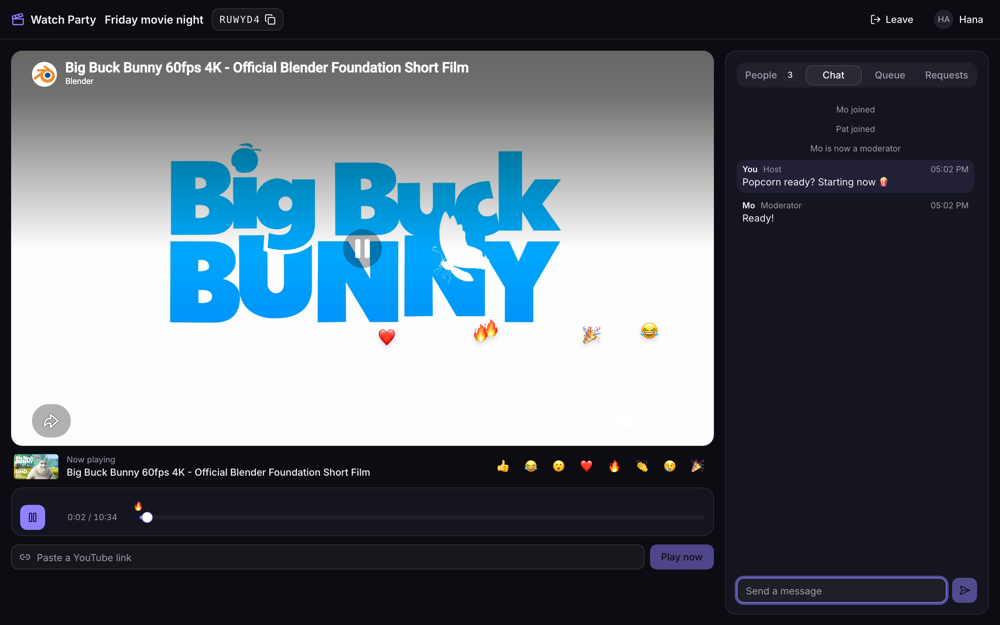
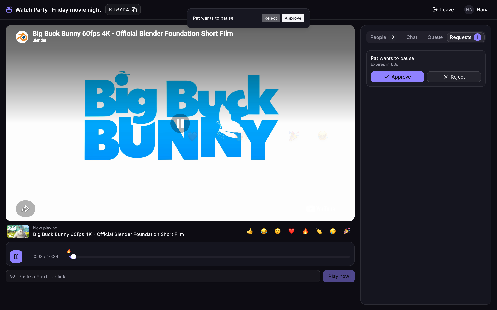
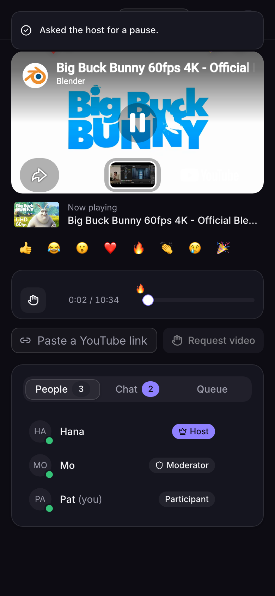

# Watch Party

Watch YouTube together, perfectly in sync. Create a room, share the link, and everyone sees the
same moment. Hosts and moderators control playback; participants ask for changes, and staff
approve them. Every action reaches the whole room in real time over WebSockets.

**Live:** https://watch-party-w4wi.onrender.com
(free tier: after a quiet spell, the first visit can take up to a minute while the server wakes up)



| A participant asks; the host approves | On a phone, as a participant |
|---|---|
|  |  |

## Features

**Core (from the brief)**
- **Rooms** with shareable links and 6-character codes. Guests join with just a name.
- **Real-time sync** of play, pause, seek and video changes. Clients correct for latency and clock
  skew, so viewers stay within about 0.1 s of each other.
- **Roles: Host, Moderator, Participant, Viewer.**
  - The host assigns roles, removes people and transfers host.
  - Every permission is enforced by the server, and the UI disables or relabels exactly what the
    server would refuse.
- **Approval workflow.** Participants request play, pause, seek, video changes and queue
  additions. Staff approve or reject from a toast or the Requests tab, and requests expire after
  60 s.
- **Live participant list** with roles and presence. A refresh or a short network drop doesn't
  kick anyone out.

**Bonus**
- **Scales out:** Redis room store with atomic compare-and-set, the Socket.IO Redis Streams
  adapter, and no sticky sessions. [Load-tested](docs/loadtest.md) at 5,000 concurrent users.
- **Persistent rooms** (Postgres) that survive restarts.
- **Authentication:** guest sessions plus optional email/password accounts; a guest's history
  carries over to the account.
- **Chat** with history, and **emoji reactions** that float over the video and mark "key
  moments" on the progress bar.
- **Video queue** that plays the next video automatically.
- **Transfer host**, plus automatic host succession if the host leaves.
- **OOP server design:** a `Room` aggregate, `Participant`, one `CommandHandler` class per event
  and a `CommandPipeline` ([architecture](docs/ARCHITECTURE.md)).
- **Accessible:** keyboard-operable, WCAG 2.1 AA audited in both themes, with a light and a dark
  theme.

## How it works

Clients send **intents** over Socket.IO, for example `pause`. Every intent goes through one
pipeline on the server:

1. validate (zod);
2. rate-limit;
3. check room membership;
4. check permission;
5. apply to the room aggregate atomically;
6. broadcast the resulting **state**: `sync_state` with a server timestamp and revision number.

Each client's `SyncEngine` projects the position from that state and the server-synced clock,
and corrects its YouTube player only when it drifts. Native YouTube controls are disabled, so
applying remote state can never echo back as a user action.

- [`docs/ARCHITECTURE.md`](docs/ARCHITECTURE.md): the architecture overview (10 minutes)
- [`docs/WALKTHROUGH.md`](docs/WALKTHROUGH.md): libraries, the WebSocket flow end to end,
  backend roles, deployment, and the issues we hit
- [`LLD.md`](LLD.md): the full low-level design

**Stack:**
- **Frontend:** React 19, Vite, TypeScript, Tailwind + shadcn/ui, Zustand, TanStack Query,
  YouTube IFrame API (`youtube-player`).
- **Backend:** Node 24, Express 5, Socket.IO 4 (Redis Streams adapter), better-auth, Drizzle +
  Postgres, Redis, zod.
- **Tooling:** pnpm monorepo, Vitest, Playwright, GitHub Actions; deployed on Render.

## Quick start (local)

Requires **Node 24.11+**, **pnpm 10** (via Corepack: `corepack enable`) and **Docker**.

```bash
git clone https://github.com/carbonFibreCode/yt-watch-party.git && cd yt-watch-party
docker compose up -d            # Postgres on :5433, Redis on :6380
cp .env.example .env            # then set BETTER_AUTH_SECRET:
                                #   sed -i.bak "s|^BETTER_AUTH_SECRET=.*|BETTER_AUTH_SECRET=$(openssl rand -base64 32)|" .env
pnpm install
pnpm dev                        # open http://localhost:5173 (API and WebSockets on :3000)
```

Database migrations run automatically when the server starts. To try two people at once, open a
second browser or a private window.

### Environment variables

Validated at startup; the server refuses to boot with readable errors if something is wrong.
An empty `NAME=` line counts as unset.

| Variable | Required | Default / example | Purpose |
|---|---|---|---|
| `PUBLIC_ORIGIN` | yes | `http://localhost:5173` | Public URL; also the WebSocket origin check |
| `DATABASE_URL` | yes | `postgres://…@localhost:5433/watchparty` | Postgres. With Neon, use the **direct** (non-pooler) URL |
| `BETTER_AUTH_SECRET` | yes | 32+ random characters | Session signing |
| `REDIS_URL` | no | `redis://localhost:6380` | Enables the multi-instance setup (Redis room store, rate limits, Socket.IO adapter). Unset: single instance, in memory |
| `BETTER_AUTH_URL` | no | `PUBLIC_ORIGIN` | Auth base URL |
| `CLIENT_IP_HEADERS` | no | `x-forwarded-for` | Header(s) with the real client IP for sign-in rate limits (`cf-connecting-ip` behind Cloudflare) |
| `METRICS_TOKEN` | no | — | 32+ chars; enables `GET /metrics` with `Authorization: Bearer <token>` |
| `PORT`, `LOG_LEVEL`, `NODE_ENV` | no | `3000`, `info`, `development` | |

### Checks

```bash
pnpm format:check && pnpm lint && pnpm typecheck
pnpm test                       # ~600 unit, integration, Postgres and Redis tests (needs docker compose up)
pnpm exec playwright install chromium webkit   # once, for browser tests
pnpm e2e                        # 18 browser tests against the local stack: real YouTube sync, roles,
                                # chat/reactions/queue, network chaos, accessibility, iPhone (WebKit)
E2E_BASE_URL=https://watch-party-w4wi.onrender.com pnpm e2e   # the same suite against production
```

## Deployment

The live app runs on **Render** from the Blueprint in [`render.yaml`](render.yaml):
- one Node web service serving the SPA, REST API and WebSockets from a single origin;
- **Neon** Postgres;
- a free **Render Key Value** (Redis) instance.

**Build and start.**
- **Build:** `corepack pnpm install --frozen-lockfile --prod=false && corepack pnpm build`.
- **Start:** `node apps/server/dist/main.mjs`.
- **Health check:** `/api/health` (reports `db` and `redis`).
- **Secrets:** Render generates `BETTER_AUTH_SECRET` and `METRICS_TOKEN`. `PUBLIC_ORIGIN` and
  `DATABASE_URL` are entered once in the dashboard.

Every push to `main` runs CI and deploys. Deployment details and the problems we hit along the
way (Corepack on a read-only filesystem, Cloudflare client IPs, the Neon pooler) are in
[WALKTHROUGH §4–5](docs/WALKTHROUGH.md#4-deployment-choices).

## Scaling out

Any number of identical instances can serve any room. Room state lives in Redis (atomic
compare-and-set in Lua), events fan out between instances through the Socket.IO Redis Streams
adapter, and there are no sticky sessions.

```bash
docker compose --profile scale up -d --build   # 2 server replicas behind nginx on http://localhost:8080
pnpm --filter @watchparty/loadtest start --rooms 20 --users 50 --duration 60
```

On one laptop, two replicas served **5,000 concurrent users with all 150,000 events delivered**
and a fan-out p99 of 6 ms. Method, numbers and limits are in [`docs/loadtest.md`](docs/loadtest.md).

## Trade-offs and known limitations

- **Free hosting:**
  - **Cold starts:** the service sleeps after about 15 idle minutes.
  - **One instance:** production runs one small instance. The multi-instance setup is tested
    locally, and scaling it in production needs a paid plan, not code changes.
- **Server-authoritative controls:** a click takes effect when the room confirms it (one round
  trip, typically tens of ms). There's no optimistic UI to roll back.
- **YouTube's own controls are hidden:** use the app's control bar (Space/K to play or pause,
  ←/→ to skip 5 s). This is what makes sync echo-free.
- **Autoplay rules:** if a browser blocks sound, video starts muted with a "Tap to unmute"
  button; some mobile browsers need one tap to start.
- **Embedding:** videos whose owners disable embedding can't play. They're rejected up front
  where YouTube reports it.
- **Signing in mid-room** switches to the account's identity: you rejoin as that account.
- **Out of scope:** playback-speed sync, non-YouTube sources, chat moderation and editing,
  password reset and email verification.

## Project documents

- [`plan.md`](plan.md): scope and timeline
- [`LLD.md`](LLD.md): low-level design (every sub-problem: why, what, how)
- [`building_plan.md`](building_plan.md): build phases, exit criteria and what each one found
- [`rules.md`](rules.md): engineering rules the code follows
- [`docs/ARCHITECTURE.md`](docs/ARCHITECTURE.md) · [`docs/WALKTHROUGH.md`](docs/WALKTHROUGH.md) · [`docs/loadtest.md`](docs/loadtest.md)
