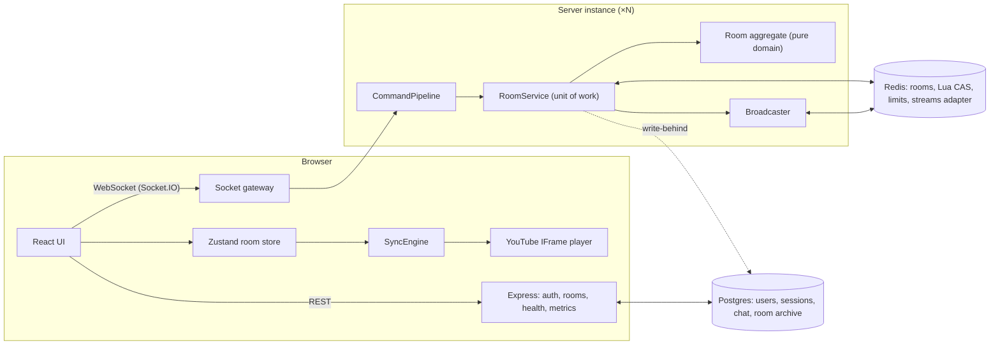

# Architecture

A condensed tour of how Watch Party works. Every section links to the matching part of
[`LLD.md`](../LLD.md), which has the full design: interfaces, constants and failure behavior.

## 1. The system at a glance



- **One origin.** One Node service serves the SPA, the REST API (`/api`) and Socket.IO. Session
  cookies are first-party, and there is no CORS.
- **Server-authoritative.** Clients send *intents*; only the server changes room state. Every
  change is broadcast as the resulting state, never as a delta.
- **Stateless instances.** Room state lives in Redis when `REDIS_URL` is set, so any instance can
  serve any socket (§7).

## 2. Code layout and layers

```
packages/shared   zod contract (events, views, errors), permission table, playback math, constants
apps/server       domain/ ◀── application/ ◀── infrastructure/ ◀── compose.ts, main.ts
apps/web          features/ (room, player, chat, reactions, queue, requests, …), lib/, components/ui
tools/loadtest    load generator (docs/loadtest.md)
```

- **Shared contract.** `packages/shared` is the single source of truth for event names and
  payloads (zod), roles and capabilities, error codes and constants. Client and server compile
  against the same types, so a payload typo is a build error on both sides.
- **Enforced layering.** The layer arrows are enforced by ESLint (`import-x/no-restricted-paths`).
  `domain/` is pure: no I/O, no clock, no randomness (lint-enforced too). Every dependency goes
  through a port in `application/ports.ts`. Concrete classes are wired only in `compose.ts`.

LLD: [§1 Design principles](../LLD.md#1-design-principles), [§3 Layout](../LLD.md#3-repository--module-layout).

## 3. The life of a command

Every client event, from `play` to `chat_message`, takes the same path:

```
socket event ─► CommandRegistry.dispatch
  ─► validate (zod schema from the shared contract)   → VALIDATION_FAILED
  ─► rate limit (rule declared by the handler)         → RATE_LIMITED
  ─► membership (is this socket's user in the room?)   → NOT_IN_ROOM
  ─► authorize (capability declared by the handler)    → FORBIDDEN
  ─► handler
       prepare      I/O outside any lock (e.g. YouTube oEmbed lookup)
       mutate       RoomService: load → re-authorize on fresh state → pure domain change → compare-and-set
       publish      domain events → wire events, to the right audience
  ─► ack { ok: true, data } | { ok: false, error: { code, message } }
```

- **Adding an event** means one zod schema plus one handler class. The pipeline, the registry
  and the other handlers don't change (Open/Closed). Boot fails if any contract event has no
  handler.
- **Re-authorization.** Authorization runs again *inside* the transaction, so a moderator demoted
  while their command was in flight can't slip it through. A deterministic test reproduces that
  race.
- **Domain events.** The domain raises events such as `RoleAssigned` and `PlaybackChanged`.
  `SocketBroadcaster` maps each one to its wire event and audience: the room, staff only, or one
  user's tabs. That keeps every `emit` in one file.

LLD: [SP-7 Command pipeline](../LLD.md#sp-7-command-pipeline), [SP-8 Broadcasting](../LLD.md#sp-8-broadcasting).

## 4. Keeping everyone in sync

The hard part of a watch party is that every viewer must see the same frame, despite network
latency, wrong local clocks, buffering, ads and autoplay rules.

1. **Time is anchored, not stored.** The server keeps `{ isPlaying, anchorPosition, anchorTime }`
   instead of a "current time" that goes stale. Anyone can compute the position at any instant:
   `anchorPosition + (now − anchorTime)` while playing. The same `projectPosition` function runs on
   the server and on every client.
2. **Clients know server time.** `timesync` (NTP-style, multi-sample, outlier-rejecting) runs over
   Socket.IO acks and estimates each client's offset to the server clock. A client whose clock is
   2 s off still computes the right position.
3. **Every change has a revision.** Each playback change bumps `rev`. Clients ignore anything
   older than what they have, so out-of-order delivery can't move playback backwards.
4. **The client engine reconciles; it never echoes.** `SyncEngine` (framework-free and
   unit-tested) compares the player with the projected position:
   - It loads a new video, enforces play/pause, and seeks only when drift exceeds 0.3 s.
   - **No echo loops, by construction.** YouTube's own controls are disabled and covered by an
     input-blocking layer. Intents only come from our control bar, so applying remote state can
     never be mistaken for a user action.
   - **Adaptive seek lead.** A player resumes slightly *behind* where it was sent (its buffering
     time). The engine learns that lag per client and aims ahead of it. Measured with real
     YouTube in two browsers, viewers settle within about 20–100 ms of each other.
   - **Autoplay rules.** If unmuted autoplay is blocked, it plays muted and shows "Tap to
     unmute"; if even that is blocked, it shows "Click to join playback".
   - **Resilience.** Player calls have deadlines; a player that never loads (a network drop
     mid-load) is detected and recovered.

LLD: [SP-5 Time model](../LLD.md#sp-5-playback-state--time-model), [SP-12 Clock sync](../LLD.md#sp-12-clock-synchronization), [SP-13 Sync engine](../LLD.md#sp-13-client-player-sync-engine).

## 5. Roles and permissions

| Capability | Host | Moderator | Participant | Viewer |
|---|:-:|:-:|:-:|:-:|
| Play, pause, seek, change video, manage queue | ✓ | ✓ | asks | — |
| Approve or reject requests | ✓ | ✓ | — | — |
| Remove members (strictly lower rank only) | ✓ | ✓ | — | — |
| Assign roles | ✓ | — | — | — |
| Transfer host | ✓ | — | — | — |
| Chat and reactions | ✓ | ✓ | ✓ | ✓ |

- **One table, two enforcers.** The matrix is data in `packages/shared/src/permissions.ts`. The
  server's `authorize` step and the client's `useCan()` (which disables or relabels controls)
  read the same table, so the UI can never offer something the server would refuse.
- **Relational rules.** "Only act on strictly lower ranks, never on yourself" runs inside the
  domain, because it needs the target's current role.
- **The approval workflow** (the brief's "participants must request approval") reuses the exact
  code of the direct commands:
  - A participant's `request_action` is validated and prepared up front (for example, the video
    is checked for embeddability), then stored as a pending request with a 60 s expiry.
  - Staff get it live, as a toast with Approve/Reject and in the Requests tab.
  - Approving runs `RequestedActions.apply`, the same function a moderator's direct command
    calls, atomically in the same commit as the resolution.
- **Credit and limits.** Approved actions are credited to the requester. Each user can have at
  most 3 pending requests, and a new request of the same kind replaces the older one.

LLD: [SP-3 Policy](../LLD.md#sp-3-roles--permission-policy), [SP-10 Approval workflow](../LLD.md#sp-10-participant-approval-workflow).

## 6. Presence, refreshes and host succession

- **Identity.** Identity is the session user, not the socket. better-auth guest sessions make
  joining one step (just a name), and accounts are optional.
- **Tabs and short drops.** Several tabs of one user are one member. A user is marked *away* only
  when their last socket on *any* instance disconnects.
  - Short drops are absorbed by Socket.IO connection-state recovery (missed events replayed).
  - Refreshes are absorbed by a 15 s grace period.
- **Leaving for good.** If the user doesn't return within the grace period, they're removed. If
  they were host, the room hands itself on: online before away, then highest role, then
  earliest joined. Roles are remembered, so a returning moderator is still a moderator.
- **No timer dependency.** Every room mutation first reaps expired members and requests. Timers
  only make the result *prompt*, so correctness doesn't depend on them, and an instance crash
  can't leave a room stuck.

LLD: [SP-9 Presence](../LLD.md#sp-9-presence-lifecycle--host-succession), [SP-4 Room aggregate](../LLD.md#sp-4-room-aggregate).

## 7. State, persistence and scaling

- **One aggregate, versioned.**
  - All state that must change together (members, roles, playback, queue, pending requests) is
    one `Room` aggregate with a version number.
  - Every change is load → pure mutation → compare-and-set on the version, run as an atomic Lua
    script in Redis. Within an instance, a per-room mutex serializes changes, so conflicts only
    occur between instances; those are retried immediately (up to 20 times).
- **Tiered storage.** Redis (or memory, for a single instance) is the hot store. Postgres keeps a
  durable archive, written behind every 5 s, plus users, sessions and chat.
  - The database is never on the realtime path.
  - Rooms survive restarts and come back on demand (read-through).
- **Fan-out between instances.** The Socket.IO Redis Streams adapter carries broadcasts. Kicks,
  role changes and presence counts work across instances (`socketsLeave`, `socketsJoin`,
  `fetchSockets`).
  - No sticky sessions: clients use WebSocket only.
  - `REDIS_URL` switches every shared-state strategy at once.
- **Evidence** ([`docs/loadtest.md`](./loadtest.md)):
  - Two replicas behind nginx served 5,000 concurrent users with all 150,000 events delivered.
  - Fan-out latency p99 was 6 ms.
  - The run found and fixed a cross-instance join-storm conflict.

LLD: [SP-6 Persistence](../LLD.md#sp-6-persistence), [SP-19 Scaling](../LLD.md#sp-19-horizontal-scaling).

## 8. Security and abuse resistance

- **Identity comes from the server.** Every socket needs a session cookie (checked at the
  handshake, together with the origin). User ids and names always come from the session, never
  from payloads.
- **Validation and limits.**
  - Every payload is validated by zod before anything else runs.
  - Per-user token buckets apply per kind of action: playback, requests, moderation, chat,
    reactions, joins.
  - Guest sign-ins are limited per client IP.
- **Headers.** Helmet's CSP allows only the YouTube origins the player needs. HSTS is on in
  production.
- **No user HTML is ever rendered.** React escapes chat as text.

LLD: [SP-2 Identity](../LLD.md#sp-2-identity--authentication), [SP-17 Security](../LLD.md#sp-17-rate-limiting--security).

## 9. Observability and testing

- **Logs.** Structured pino logs: one line per command, with event, outcome and duration, from a
  per-socket child logger.
- **Metrics.** Prometheus at `/metrics`, behind a bearer token: commands by outcome, command
  latency, compare-and-set attempts, broadcasts, connected sockets and active rooms.
- **Tests** (about 600 unit and integration tests, plus 16 Playwright tests):
  - **Domain, unit:** rules, succession and requests, with a fake clock and no mocks.
  - **Contract suite:** one suite runs against every room store (memory, Redis, tiered), which
    proves they're interchangeable.
  - **Integration:** the real composed server over real sockets, including two instances on one
    Redis.
  - **Browser:** real YouTube in several browsers (sync, roles, chat/reactions/queue, network
    chaos), plus axe-core accessibility audits in both themes. The same suite runs against
    production.

LLD: [SP-20 Observability](../LLD.md#sp-20-config-observability-composition-root), [SP-22 Testing](../LLD.md#sp-22-testing-strategy).

## 10. Trade-offs worth knowing

| Decision | Why | Cost |
|---|---|---|
| Server-authoritative, no optimistic playback UI | One code path, no rollback logic; the button reflects the room | One round trip (tens of ms) before a click shows |
| Disable YouTube's native controls | Removes echo loops by construction | Our control bar has to cover what users need |
| Optimistic CAS instead of distributed locks | No lock leases or crash recovery; Redis Lua is atomic | Retries under cross-instance contention (measured, bounded) |
| Room as one aggregate | Atomic invariants (exactly one host, bans, requests) | Every change rewrites the room hash (a few KB); fine at 100 members |
| Chat outside the aggregate | Chat needn't be consistent with playback | Separate store and path |
| Guest-first identity | Joining takes a name, not a sign-up | Signing in mid-room rejoins as the account (documented) |
| Free-tier hosting | Zero cost | Cold start after idle; one small instance in production |
